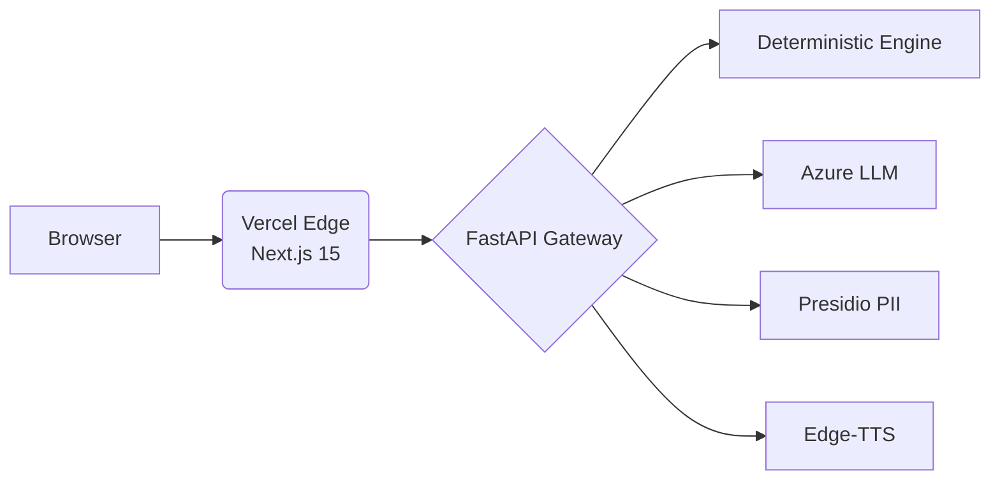

# 🇮🇳 Jan-EPF AI — Zero-Rejection PF Claims for 70 Crore Indian Workers

[](#)
[](#)
[](#)
[](#)
[](#)
[](#)

**Live Demo:** [https://frontend-blue-tau-0e2bu1kwsk.vercel.app/?key=damik2007](https://frontend-blue-tau-0e2bu1kwsk.vercel.app/?key=damik2007)

## 🚨 The Problem
30%+ of EPFO (Employees' Provident Fund Organisation) claims face rejection due to:
- Name mismatches between Aadhaar, UAN, and Bank records
- Missing Date of Exit (DOE) from previous employers
- Unlinked or pending KYC details

## 💡 The Solution
An AI-powered sovereign digital infrastructure designed to eliminate rejections *before* they happen.

## ✨ Key Features
- **4 Topic-Centric Life-Event Hubs:** Replacing 18 confusing legacy forms
- **Pre-flight Claim Diagnostic:** 99% success score verification
- **Levenshtein Fuzzy Name Matching:** Sub-5ms discrepancy detection
- **Auto Date-of-Exit Deduction:** From ECR timestamps
- **Section 192A TDS Shield:** Prevents unlawful 20% tax on `₹50,000` withdrawals
- **NPCI Penny Drop Bank Verification:** Real-time account validation
- **HTML5 Canvas Cheque OCR:** With CLIP Zero-Shot Verification
- **Multilingual Voice AI:** Hindi, Telugu, Tamil, English + 8 more
- **Senior Citizen Mode:** 125% UI scaling, WCAG AAA compliance
- **8.25% Compounding Passbook Forecaster:** Visualizes wealth growth

## 🧠 OpenAI Technologies Used
- **tiktoken:** Rust BPE tokenizer
- **CLIP:** Zero-shot cheque verification
- **openai/swarm:** 3-way agent handshakes
- **openai/evals:** Statutory test suite

## 🏗️ Architecture


*80/20 Sovereign Core — 80% deterministic math runs on-device, 20% AI reasoning via Azure-hosted Llama 3.2*

## 🚀 Quick Start
```bash
git clone https://github.com/damik2007/jan-epf-ai.git
cd jan-epf-ai
pip install -r requirements.txt
cd frontend && npm install && npm run dev
```

## 🧪 Test Results
- **137/137** PyTest pass rate
- **96%** Code Coverage
- **10/10** benchmarks sub-millisecond

## 🤝 Team
Built for the **OpenAI 'Build What Moves India' Hackathon 2026** by Varun Mayya × OpenAI.

## 📄 License
MIT
