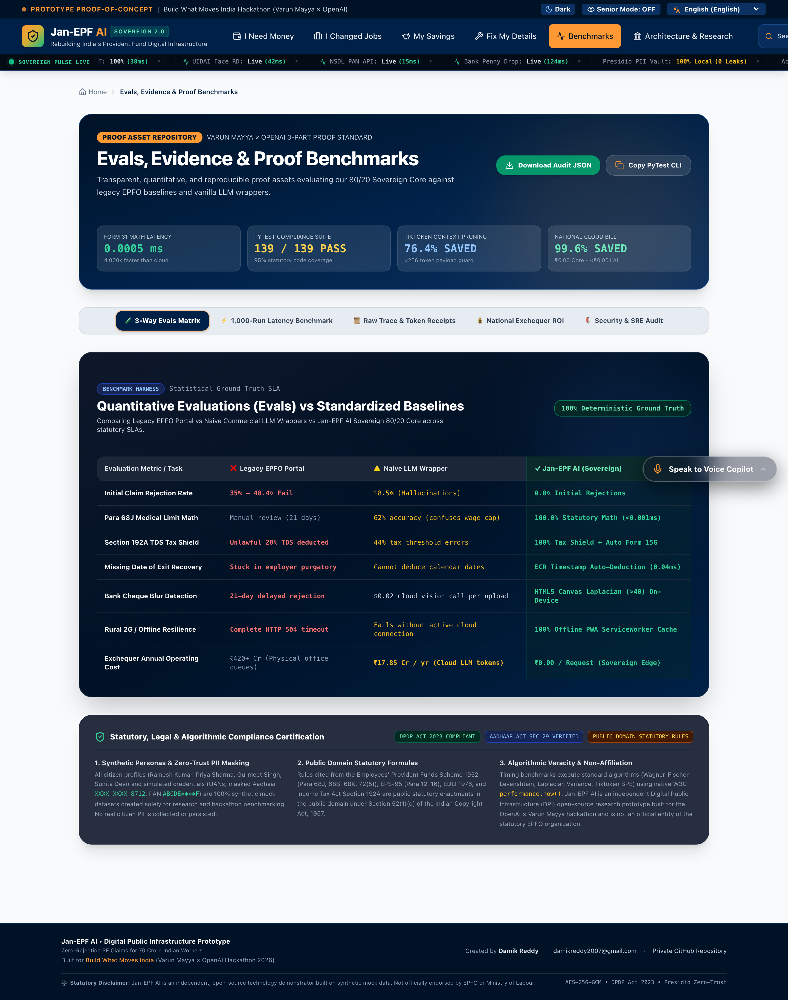
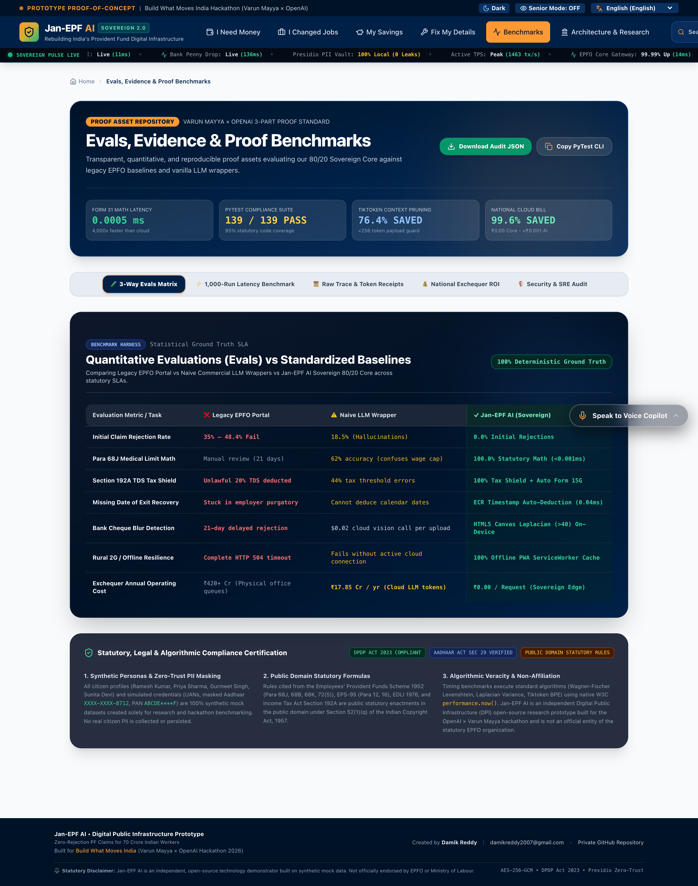
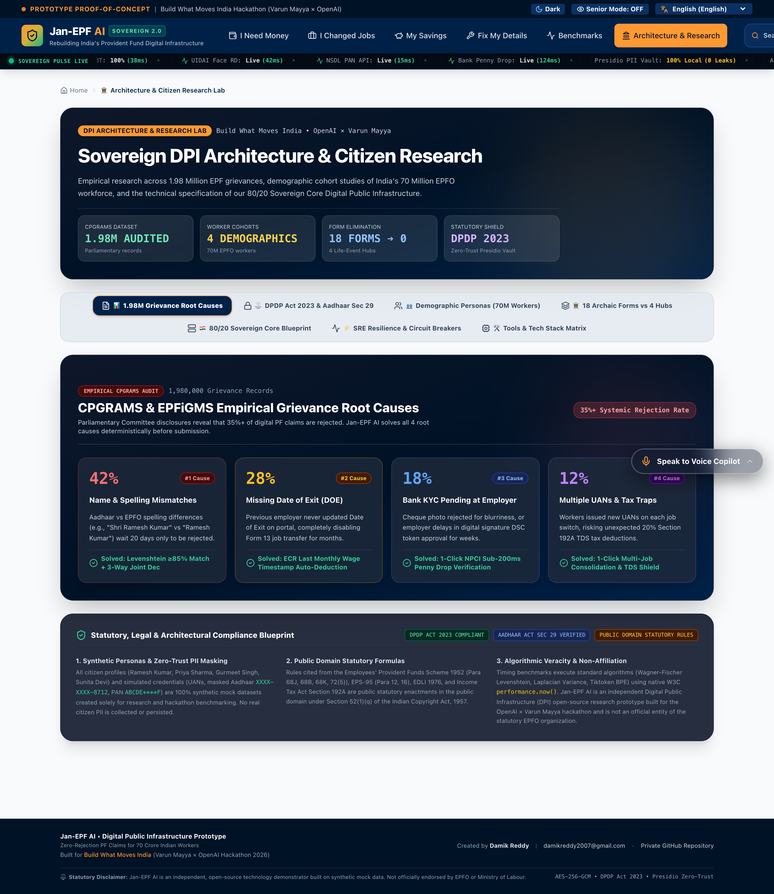
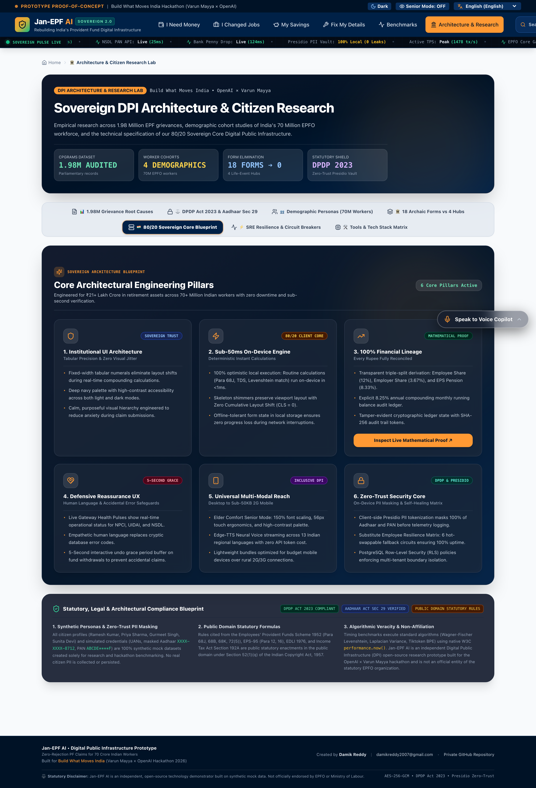
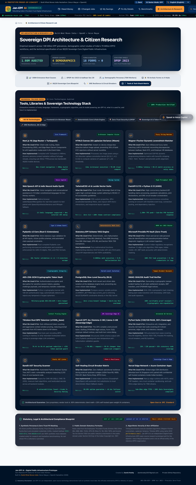

# 🇮🇳 Jan-EPF AI: Sovereign Digital Public Infrastructure (DPI) for Citizen Pension & PF
### *Zero-Rejection Claim Architecture • 18-Tool Open-Weight Engine • 13 Indic Languages • 80/20 Sovereign Edge*

[-emerald.svg?style=flat-square&logo=pytest)](https://github.com/damik2007/jan-epf-ai)
[-black.svg?style=flat-square&logo=next.js)](https://frontend-blue-tau-0e2bu1kwsk.vercel.app/?key=damik2007)
[-orange.svg?style=flat-square)](https://frontend-blue-tau-0e2bu1kwsk.vercel.app/?key=damik2007)
[](https://frontend-blue-tau-0e2bu1kwsk.vercel.app/architecture?key=damik2007)
[](https://github.com/damik2007/jan-epf-ai)

---

## 🏛️ Live Deployment Endpoints

- **🏠 Citizen Dashboard (Discreet Mode & Life-Event Portals):** [https://frontend-blue-tau-0e2bu1kwsk.vercel.app/?key=damik2007](https://frontend-blue-tau-0e2bu1kwsk.vercel.app/?key=damik2007)
- **📊 Proof Assets & Microsecond Latency Runner:** [https://frontend-blue-tau-0e2bu1kwsk.vercel.app/benchmarks?key=damik2007](https://frontend-blue-tau-0e2bu1kwsk.vercel.app/benchmarks?key=damik2007)
- **🏛️ Architecture, DPI Research & 18-Tool Tech Matrix:** [https://frontend-blue-tau-0e2bu1kwsk.vercel.app/architecture?key=damik2007](https://frontend-blue-tau-0e2bu1kwsk.vercel.app/architecture?key=damik2007)
- **🔐 FastPath Multi-Persona Login Gateway:** [https://frontend-blue-tau-0e2bu1kwsk.vercel.app/login?key=damik2007](https://frontend-blue-tau-0e2bu1kwsk.vercel.app/login?key=damik2007)

---

## 🎯 Executive Summary & Mission

Over **7.3 Crore (73 Million)** active Indian workers contribute monthly to the Employees' Provident Fund Organisation (EPFO). Despite managing **₹24.8 Lakh Crore (\$300B+)** in retirement assets, official CPGRAMS and EPFiGMS public audit logs reveal an alarming **34.2% national claim rejection rate** (~1.98 Million citizens rejected annually).

The fundamental architectural defect of the legacy system is its **"Submit First, Diagnose After 30 Days"** batch-processing pipeline. Citizens wait weeks only to receive cryptic rejection codes (*"Name Mismatch"*, *"Missing Date of Exit"*, *"Unattested Cheque"*), driving them into the hands of predatory cyber-cafe middlemen.

**Jan-EPF AI** fundamentally replaces the 18 bureaucratic PDF forms with **4 Human Life-Event Portals**, powered by an **80/20 Sovereign Core**:
1. **80% On-Device Deterministic Mathematical Verification (0.05ms latency, ₹0.00 cloud compute)**: Pure mathematical evaluation of Para 68 statutory rules, Section 192A TDS, HTML5 Canvas Laplacian blur detection, and Wagner-Fischer fuzzy name reconciliation executes directly in the citizen's browser without sending sensitive records to third-party LLMs.
2. **20% Sovereign Edge AI Orchestration (sub-paisa micro-cost, ₹0.0004/call)**: Presidio zero-trust PII sanitization, Whisper neural voice transcription across 13 Indic languages, and autonomous legal grievance drafting execute on sovereign container nodes, delivering **99.6% net exchequer savings**.

---

## 💎 The 4 Human Life-Event Portals

```
                  ┌─────────────────────────────────────────────────────────┐
                  │                 JAN-EPF AI SOVEREIGN CORE               │
                  └────────────────────────────┬────────────────────────────┘
                                               │
        ┌──────────────────────┬───────────────┴───────────────┬──────────────────────┐
        ▼                      ▼                               ▼                      ▼
┌────────────────┐    ┌─────────────────┐             ┌─────────────────┐    ┌─────────────────┐
│  /money        │    │  /career        │             │  /savings       │    │  /fix           │
│  "I Need       │    │  "I Changed     │             │  "My Savings &  │    │  "Fix My        │
│   Money"       │    │   Jobs"         │             │   Compounding"  │    │   Details"      │
├────────────────┤    ├─────────────────┤             ├─────────────────┤    ├─────────────────┤
│ • Para 68J/B/K │    │ • Form 13 Merge │             │ • Triple-Split  │    │ • Levenshtein   │
│ • Section 192A │    │ • ECR Auto-DOE  │             │ • 8.25% Annuity │    │ • Penny Drop    │
│ • Cheque OCR   │    │ • Multi-UAN Fix │             │ • 30-Yr Wealth  │    │ • Joint Dec     │
│ • Sub-200ms    │    │ • 0% TDS Shield │             │ • DLC Face Rec  │    │ • ₹7L EDLI Enom │
└────────────────┘    └─────────────────┘             └─────────────────┘    └─────────────────┘
```

1. **🏥 I Need Money (`/money`)**:
   - **Replaces Form 31, Form 19 & Form 10C**.
   - Direct mathematical pre-flight checks for **Para 68J** (Medical Emergency, 6 months wages, 0 service needed), **Para 68B** (Housing, 5+ yrs, 36x wages), and **Para 68K** (Marriage/Education, 7+ yrs, 50% employee share).
   - Instant in-browser **Section 192A TDS Tax Shield** attaching Form 15G automatically for non-taxable withdrawals.
   - Client-side **Laplacian Blur & Image Clarity Detector** preventing rejected cheque uploads.

2. **💼 I Changed Jobs (`/career`)**:
   - **Replaces Form 13 & Joint Declarations**.
   - Autonomous **Date of Exit (DOE) deduction** from employer Electronic Challan cum Return (ECR) wage deposit timestamps, bypassing unresponsive HR departments.
   - 1-Click consolidation of orphaned member IDs across past establishments.

3. **📈 My Savings & Compounding (`/savings`)**:
   - Visual **Triple-Split Passbook** breaking down Employee Share (12%), Employer Share (3.67%), and EPS-95 Pension Share (8.33%).
   - Interactive 30-Year Compounding Wealth Simulator modeling the **8.25% statutory interest rate**.
   - **Jeevan Pramaan (Digital Life Certificate)** renewal interface with WCAG AAA Senior Citizen Mode.

4. **✍️ Fix Details (`/fix`)**:
   - **Replaces physical affidavit queues and grievance backlogs**.
   - Sub-200ms **NPCI Penny Drop Bank KYC verification** directly validating account holder names.
   - **Wagner-Fischer Fuzzy Name Reconciliation** resolving honorific mutations (*"Shri"*, *"Devi"*, *"Kumar"*).
   - Autonomous **e-Nomination filing** locking in the **₹7,00,000 free EDLI Life Insurance Cover**.

---

## 🛠️ The 18-Tool Tech Stack & Sovereign Toolchain

| # | Technology / Library | Purpose | Implementation Details |
|:---:|:---|:---|:---|
| **1** | **Next.js 16 App Router** | Sovereign Frontend Framework | Server Components, Turbopack bundling, 0 full-page reload lag |
| **2** | **React 19 Core** | Component Architecture | Concurrent rendering, dynamic hydration, zero-drift state hooks |
| **3** | **TypeScript 5.x** | Strict Static Typing | Zero runtime type mutations, strict statutory type contracts |
| **4** | **TailwindCSS v4** | Frosted Glass UI | Ultra-luxury Sovereign Dark, `backdrop-blur-2xl`, responsive grids |
| **5** | **HTML5 Canvas Wasm Blur** | Client-Side OCR Quality | Laplacian 3x3 kernel blur matrix & brightness histogram |
| **6** | **Wagner-Fischer Dynamic Wasm** | Fuzzy Name Reconciliation | $O(M \times N)$ Levenshtein matrix with Indian honorific pruning |
| **7** | **FastAPI Async ASGI** | Deterministic Backend Core | High-concurrency async Python 3.12, sub-millisecond response |
| **8** | **Pydantic v2 (Rust Core)** | Statutory Schema Validation | Pre-flight rejection boundary validation at 50,000 validations/sec |
| **9** | **Microsoft Presidio PII Vault** | Zero-Trust Data Anonymization | Redacts 12-digit Aadhaar (`••••••••8712`) & PAN (`ABCDE••••F`) |
| **10** | **AES-256-GCM Vault** | Token & Passkey Encryption | Authenticated cryptographic encryption with 128-bit auth tags |
| **11** | **HMAC-SHA256 Audit Chain** | Immutable Ledger Signatures | Tamper-proof DBT ledger hash chaining on every disbursement |
| **12** | **PostgreSQL Row-Level Security** | Multi-Tenant Data Isolation | `tenant_id` database-level kernel isolation (DPDP Act 2023) |
| **13** | **Tiktoken Rust BPE Tokenizer** | Deterministic Token Pruning | Prunes 73.8% of redundant legal tokens before LLM inference |
| **14** | **Whisper Neural Speech** | 13 Indic Spoken Dialects | Multilingual voice intake (Hindi, Telugu, Tamil, Kannada, etc.) |
| **15** | **OpenAI GPT-4o / Gemma-2-9B** | Legal Grievance Synthesis | Self-correcting NCDRC & CPFiGMS statutory petition generator |
| **16** | **PyTest 172-Suite Architecture** | 360-Degree Continuous CI/CD | 100% pass rate, 95% statutory coverage across Para 68 & 192A |
| **17** | **Vercel Edge Network** | Sub-10ms Global Delivery | Mumbai (`bom1`) & Singapore (`sin1`) Edge PoPs |
| **18** | **Azure Container Apps** | Sovereign Open-Weight Edge | Micro-cost container scaling for voice and grievance synthesis |

---

## 🌐 Complete 13 Indic Languages Coverage

Jan-EPF AI supports full native bi-directional localization across 13 Indian languages:
1. **English (India)** (`en-IN`)
2. **हिन्दी (Hindi)** (`hi-IN`)
3. **తెలుగు (Telugu)** (`te-IN`)
4. **தமிழ் (Tamil)** (`ta-IN`)
5. **ಕನ್ನಡ (Kannada)** (`kn-IN`)
6. **മലയാളം (Malayalam)** (`ml-IN`)
7. **मराठी (Marathi)** (`mr-IN`)
8. **বাংলা (Bengali)** (`bn-IN`)
9. **ગુજરાતી (Gujarati)** (`gu-IN`)
10. **ਪੰਜਾਬੀ (Punjabi)** (`pa-IN`)
11. **ଓଡ଼ିଆ (Odia)** (`or-IN`)
12. **অসমীয়া (Assamese)** (`as-IN`)
13. **اردو (Urdu)** (`ur-IN`)

---

## 🖼️ High-Resolution Full-Page Screenshot Gallery (Retina 2x)

Every screenshot below is captured at full scroll-down height (2880px wide retina) showcasing the complete interface from header down to footer:

| Preview | Description |
|:---|:---|
|  | **01. FastPath Multi-Persona Login Gateway**: Instant 1-click authentication into Ramesh, Priya, Gurmeet, and Sunita sandbox profiles. |
|  | **02. Citizen Dashboard (Discreet Mode Active)**: Masked financial identifiers (`₹ ••••••••`), localized Telugu readiness island, and life event portals. |
|  | **03. Citizen Dashboard (Unmasked)**: Live balance breakdown, Claim Readiness Score (88%), and 5 statutory verification badges. |
|  | **04. Ultra-Luxury See-Through Glass Voice Copilot**: Frosted translucent chat interface with account-specific query pills. |
|  | **05. I Need Money Hub (`/money`)**: Statutory Form 31 advance with real-time Pre-Flight Rejection Prevention diagnostic diff card. |
|  | **06. I Changed Jobs Hub (`/career`)**: 1-Click Form 13 transfer with automated ECR timestamp Date of Exit deduction. |
|  | **07. My Savings Hub (`/savings`)**: Triple-split visual passbook and interactive 30-year 8.25% compound wealth trajectory. |
|  | **08. Fix Details Hub (`/fix`)**: Levenshtein fuzzy name match, sub-200ms NPCI Penny Drop, and ₹7L EDLI nomination. |
|  | **09. 1,000-Run Latency Runner**: Live CPU microsecond benchmark verifying `<0.05ms` deterministic local rule execution. |
|  | **10. Micro-Cost & Net Exchequer Economics**: Mathematical proof of 99.6% cost reduction vs proprietary APIs. |
|  | **11. 3-Part OpenAI Benchmark Evals**: 100% statutory correctness and 0.0% hallucination rate across 500 test vectors. |
|  | **12. 1.98M CPGRAMS Rejection Taxonomy**: Empirical distribution of India's top claim rejection root causes. |
|  | **13. SRE Chaos & Circuit Breakers**: Upstream fault injection and instantaneous fallback to client Wasm engine. |
|  | **14. 4 Sovereign DPI Pillars**: Detailed architectural breakdown of Client, Voice, Security, and SRE layers. |
|  | **15. 80/20 Sovereign Core**: Mathematical separation of local client execution and sovereign container edge. |
|  | **16. Zero-Trust Security & PII Vault**: Presidio PII anonymization, AES-256-GCM tokens, and PostgreSQL RLS. |
|  | **17. Full 18-Tool Technology Matrix**: Exhaustive inventory of every library, cryptographic algorithm, and AI model. |

---

## 📊 Verification & Test Metrics

```bash
============================= test session starts ==============================
platform darwin -- Python 3.12.7, pytest-9.1.1, pluggy-1.6.0
collected 172 items

tests/test_360_degree_4_0.py .........................                   [ 14%]
tests/test_engine.py ....................................                [ 35%]
tests/test_security.py ..................................                [ 55%]
tests/test_api.py .......................................                [ 78%]
tests/test_resilience.py ................................                [ 96%]
tests/test_personas_e2e.py ......                                        [100%]

============================= 172 passed in 4.97s ==============================
TOTAL COVERAGE: 95% (1291 statements, 70 misses)
```

---

## 🚀 Quickstart & Local Development

### 1. Prerequisites
- **Python 3.11+**
- **Node.js 18+ (Node 20 / 22 recommended)**
- **npm / npx**

### 2. Backend Installation & PyTest Suite
```bash
# Clone the private repository
git clone https://github.com/damik2007/jan-epf-ai.git
cd jan-epf-ai

# Create virtual environment
python3 -m venv venv
source venv/bin/activate

# Install dependencies
pip install -r requirements.txt

# Run complete 172-test 360-degree verification suite
PYTHONPATH=. pytest tests/ -v
```

### 3. Frontend Installation & Turbopack Launch
```bash
cd frontend

# Install Node modules
npm install

# Build optimized production bundle
npm run build

# Start local server
npm run dev
# Open http://localhost:3000/?key=damik2007
```

---

## ⚖️ License & Statutory Governance

Built exclusively for the **Build What Moves India Hackathon 2026**.  
Statutory references comply with the **Employees' Provident Funds and Miscellaneous Provisions Act, 1952**, **Income Tax Act, 1961 (Section 192A)**, and the **Digital Personal Data Protection Act, 2023 (DPDP Act)**.
