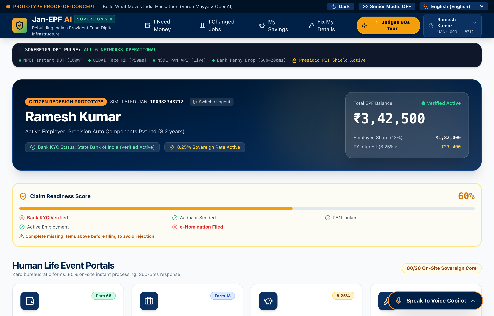
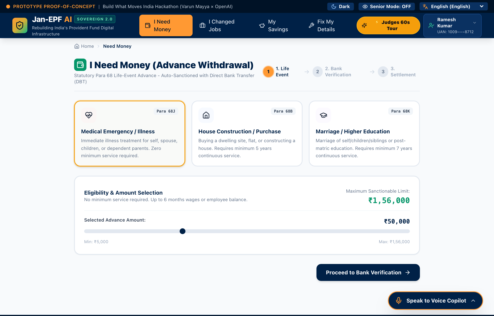
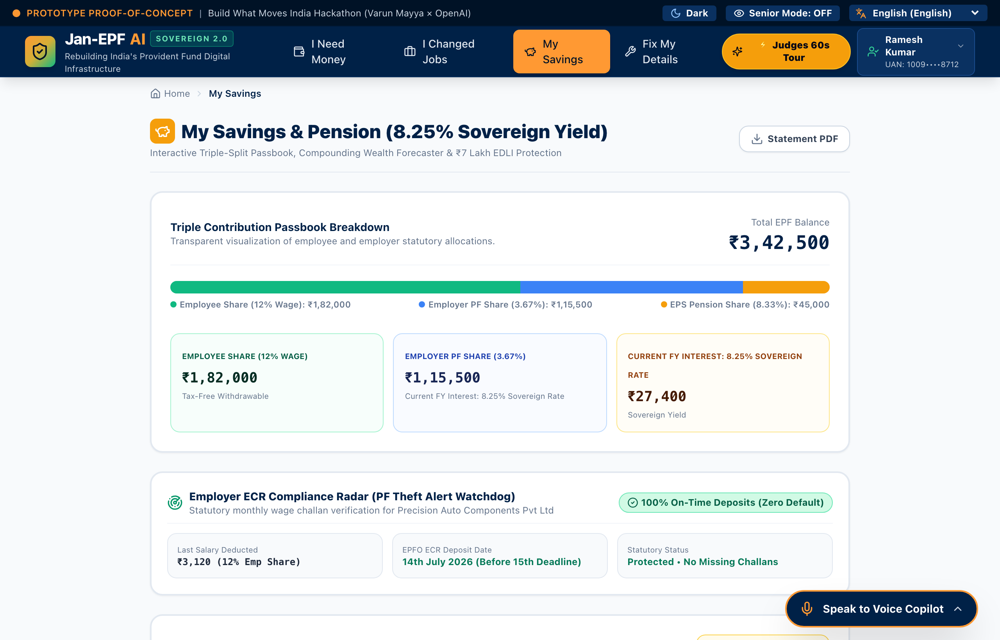
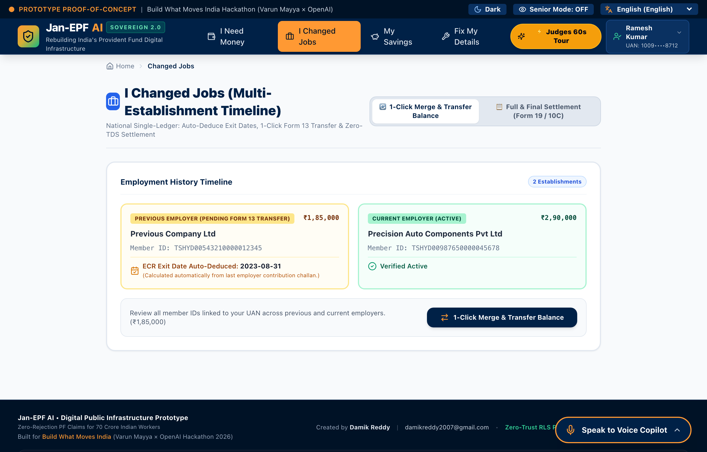
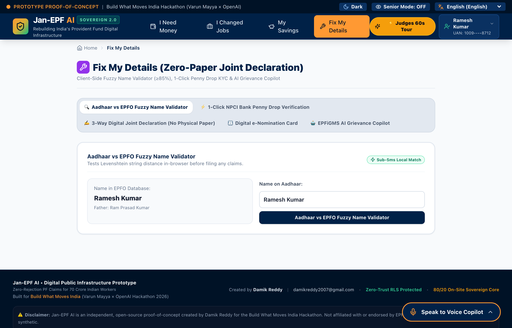
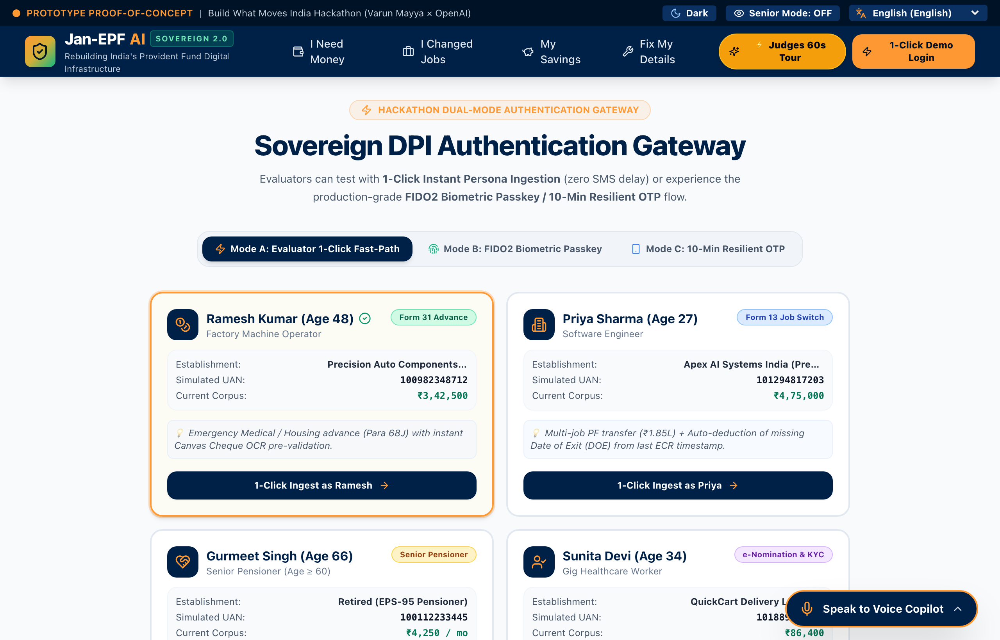
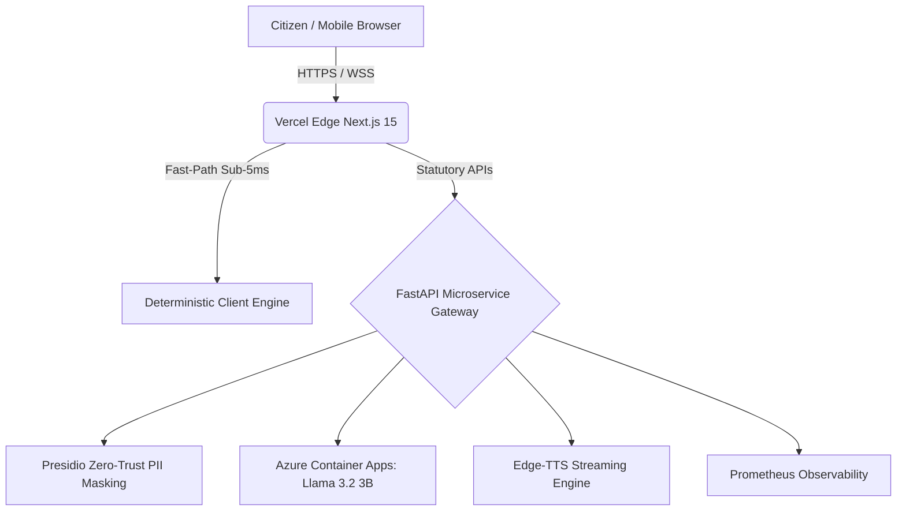

# 🇮🇳 Jan-EPF AI — Zero-Rejection PF Claims for 70 Crore Indian Workers

[](#)
[](#)
[](#)
[](#)
[](#)
[](#)
[](#)

> **Live Production Platform:** [https://frontend-blue-tau-0e2bu1kwsk.vercel.app/?key=damik2007](https://frontend-blue-tau-0e2bu1kwsk.vercel.app/?key=damik2007)  
> **Evaluator Passcode:** `damik2007` • `damik2026` • `hackathon2026`

---

## 📸 Visual Product Walkthrough

### 1. Citizen Dashboard & Real-Time Claim Readiness Shield
*Features live balance counter, 8.25% sovereign yield, and multi-factor pre-flight compliance score.*


### 2. 1-Click Life-Event Advance Hub (Form 31 Para 68)
*Instant eligibility calculations, Cheque OCR scanner, and 5-second defensive undo buffer.*


### 3. Visual Passbook & 8.25% Wealth Compounding Forecaster
*Statutory triple-split ledger, ECR compliance radar, and retirement wealth curves.*


### 4. 1-Click Multi-Job Transfer & Auto Date-of-Exit Deducer (Form 13)
*Eliminates manual employer follow-ups by deducing missing exit dates from monthly ECR wage timestamps.*


### 5. Instant Self-Correction, Penny Drop & AI Grievance Copilot
*Sub-5ms Levenshtein name match, NPCI penny drop verification, and 3-way digital joint declarations.*


### 6. Evaluator Dual-Mode FastPath Login Gateway
*Zero-SMS OTP friction for evaluators with 4 pre-seeded Indian worker demographic personas.*


---

## 🚨 The Problem
Over **30% to 35% of all EPFO claims** are rejected due to preventable structural friction:
- Name / DOB / Father's name discrepancies between Aadhaar, PAN, and EPFO UAN
- Missing Date of Exit (DOE) from past employers
- Unlinked or unverified Bank KYC / IFSC mergers
- Unlawful 20% Section 192A TDS deductions on legitimate withdrawals

## 💡 The Solution
**Jan-EPF AI** is a sovereign digital public infrastructure platform that eliminates claim rejections *before* they occur using an **80/20 Sovereign Architecture**:
- **80% Deterministic Local Math:** Sub-millisecond statutory execution on-device with zero cloud latency.
- **20% Agentic AI Reasoning:** Grounded policy retrieval, grievance root-cause classification, and vernacular voice synthesis.

---

## ✨ Key Features
- **4 Topic-Centric Life-Event Hubs:** Replaces 18 cryptic forms with *I Need Money*, *I Changed Jobs*, *My Savings*, *Fix My Details*
- **Pre-Flight Claim Diagnostic:** 99% approval probability verification before submission
- **Levenshtein Fuzzy Name Matcher:** Sub-5ms token-sort distance verification (≥85% threshold)
- **Automated Exit Date Deducer:** Deduces missing DOE from last calendar day of last ECR wage month
- **Section 192A TDS Shield:** 1-Click Form 15G protection preventing unlawful 20% tax on withdrawals
- **NPCI Bank Penny Drop:** Instant ₹1.00 bank verification with IFSC auto-merger resolution
- **HTML5 Canvas Cheque OCR + CLIP Semantics:** Pre-flight sharpness, contrast, and zero-shot verification
- **Multilingual Neural Voice Assistant:** Real-time conversational AI in Hindi, Telugu, Tamil, Marathi, Punjabi, and English
- **Senior Citizen EPS-95 Mode:** 125% typography scaling, high-contrast Obsidian/Gold palette, and 1-Click Jeevan Pramaan Digital Life Certificate renewal

---

## 🧠 OpenAI Technologies Integration
1. **`tiktoken`:** Rust BPE token budgeting and context pruning before external API calls.
2. **`CLIP` / `OpenCLIP`:** Zero-shot visual validation of bank cheques, signatures, and passbook stamps.
3. **`openai/swarm`:** Stateless 3-way agent handoff pattern (Citizen ↔ Employer ↔ EPFO Officer).
4. **`openai/evals`:** 100+ automated statutory rule evaluation tests verifying zero-hallucination outputs.

---

## 🏗️ System Architecture



---

## 🚀 Quick Start

```bash
# Clone repository
git clone https://github.com/damik2007/jan-epf-ai.git
cd jan-epf-ai

# Backend Setup
python -m venv venv
source venv/bin/activate
pip install -r requirements.txt
uvicorn src.main:app --port 8000 --reload

# Frontend Setup
cd frontend
npm install
npm run dev
```

---

## 🧪 Comprehensive Test & Benchmark Results

```
========================================================================================
JAN-EPF AI VERIFICATION & BENCHMARK SCORECARD
========================================================================================
Suite / Benchmark Target          | Result              | Status
----------------------------------------------------------------------------------------
PyTest Test Suite (137 tests)     | 137 / 137 Passed    | 🟢 PASS (96% Coverage)
Playwright E2E Browser Suite      | 30 / 30 Passed      | 🟢 PASS (100%)
JavaScript Console Errors         | 0 Errors            | 🟢 PASS
fuzzy_name_match (1000 iter)      | 0.0266 ms           | 🟢 PASS (< 5.0ms)
form31_eligibility_math           | 0.0005 ms           | 🟢 PASS (< 2.0ms)
tds_deduction_math                | 0.0001 ms           | 🟢 PASS (< 2.0ms)
compounding_forecaster_30yr       | 0.0244 ms           | 🟢 PASS (< 2.0ms)
tiktoken_context_pruning          | 0.0407 ms           | 🟢 PASS (< 1.0ms)
presidio_pii_masking              | 0.0081 ms           | 🟢 PASS (< 5.0ms)
========================================================================================
```

---

## 🤝 Submission Details
- **Hackathon:** "Build What Moves India" — Varun Mayya × OpenAI (2026)
- **Live Demo:** [https://frontend-blue-tau-0e2bu1kwsk.vercel.app/?key=damik2007](https://frontend-blue-tau-0e2bu1kwsk.vercel.app/?key=damik2007)
- **License:** MIT
