# RFC-001: Jan-EPF AI Systems Architecture Specification
## Rebuilding India's Provident Fund (EPFO) Digital Public Infrastructure (DPI) for 70 Million Citizens

```
====================================================================================================
RFC NUMBER:        RFC-001 (Final / Approved Architecture Standard)
PROJECT:           Jan-EPF AI ("Build What Moves India" Hackathon Initiative)
AUTHOR:            Damik Reddy (Lead Systems Architect & Principal Forward Deployed Engineer)
TARGET PLATFORM:   EPFO (Employees' Provident Fund Organisation, MoL&E, Govt of India)
VERSION:           1.0.0 (Contract-First Production Specification)
SECURITY CLASSIF:  OFFICIAL / DIGITAL PUBLIC INFRASTRUCTURE (DPI) STANDARD
STATUS:            APPROVED FOR SPRINT EXECUTION
====================================================================================================
```

---

## 1. Executive Summary & Problem Framing

### 1.1 The High-Stakes Reality of EPFO
The **Employees' Provident Fund Organisation (EPFO)** is the world's largest social security organisation, managing over **$250 Billion+ (₹21+ Lakh Crores)** in retirement assets for **70+ million active formal and gig workers** across India. For the vast majority of Indian workers—from industrial factory operators in Manesar to gig delivery partners in Bengaluru and senior pensioners in Punjab—this fund represents their lifetime savings, emergency medical liquidity reserve, and sole old-age pension safety net.

Despite its critical national role, the existing digital interface suffers from severe systemic friction:
1. **Pervasive Server Downtime & Timeouts:** Frequent HTTP 500 crashes, session dropouts during multi-step forms, and database lockouts during peak ECR filing windows.
2. **Cryptic, Delayed Rejections (15–20 Days):** Citizens wait weeks only to receive one-line cryptic rejections (*e.g., "Name mismatch" or "Member signature missing"*), forcing redundant submissions.
3. **Bureaucratic Jargon Overload:** Citizens are forced to decipher legacy bureaucratic form numbers (*Form 31, Form 19, Form 10C, Form 13, Form 10D, Form 5IF*) rather than selecting intuitive human life events.
4. **Outdated Paper Joint Declarations:** Minor typographical errors in date of birth, joining date, or name require physical tripartite forms with physical employer rubber stamps and field-office visits.

```
+--------------------------------------------------------------------------------------------------+
|                                    EPFO BY THE NUMBERS                                           |
+------------------------------------+----------------------------------+--------------------------+
|  70 Million+ Active Members        |  $250 Billion+ Assets Under Mgmt |  2.5 Crore Annual Claims |
+------------------------------------+----------------------------------+--------------------------+
|  48.8% Historic Rejection Rate     |  15-20 Days Average Turnaround   |  3.4 Million Grievances  |
+------------------------------------+----------------------------------+--------------------------+
```

### 1.2 The Jan-EPF AI Paradigm Shift
**Jan-EPF AI** re-architects India's provident fund infrastructure into an **Intent-First, Topic-Centric, Zero-Paper Digital Public Good**. It eliminates the root causes of claim rejection at the source through client-side pre-validation, replaces forms with natural language understanding, provides instantaneous visual passbook intelligence, and guarantees 100% operational resilience.

```
LEGACY EPFO WORKFLOW (20 DAYS FRICTION):
[Citizen Form Entry] ---> [Blind Server Upload] ---> [Manual Clerk Queue (15 Days)] ---> [Cryptic Rejection]

JAN-EPF AI ARCHITECTURE (SUB-2-SECOND ZERO-REJECTION):
[Voice/Intent Ingest] -> [80% On-Site Pre-Validation] -> [Smart OCR & Penny-Drop] -> [Instant 1-Click Approval]
```

---

## 2. The 10 Preserved & AI-Upgraded EPFO Foundation Pillars

Jan-EPF AI honors statutory integrity. We preserve the foundational bedrock of India's social security laws (EPF Act 1952, EPS-95, EDLI 1976) and upgrade the delivery mechanism with modern AI engineering and universal ergonomics:

```
+===================================================================================================+
|                        TOP 10 PRESERVED & AI-UPGRADED EPFO FOUNDATION PILLARS                     |
+---+----------------------------+--------------------------------+---------------------------------+
| # | Foundation Pillar          | Statutory Purpose              | Jan-EPF AI Modern Upgrade       |
+---+----------------------------+--------------------------------+---------------------------------+
| 1 | Universal Account Number   | Lifetime portable identity     | Unified multi-employer timeline |
|   | (UAN)                      | across all formal jobs.        | with 1-click auto-consolidation.|
+---+----------------------------+--------------------------------+---------------------------------+
| 2 | Direct Benefit Transfer    | Direct bank disbursement with  | Real-time NPCI 1-Click Penny-   |
|   | (DBT)                      | zero middleman leakage.        | Drop pre-verification.          |
+---+----------------------------+--------------------------------+---------------------------------+
| 3 | Triple Contribution Model  | 12% Emp + 3.67% Empr PF        | Interactive visual asset split  |
|   | (EPF + EPS Architecture)   | + 8.33% EPS Pension Fund.      | with real-time growth curves.   |
+---+----------------------------+--------------------------------+---------------------------------+
| 4 | 8.25% Sovereign Compound   | Government-backed guaranteed   | Fiscal year compounding engine  |
|   | Interest                   | tax-free wealth accumulation.  | with age-58 wealth forecasting. |
+---+----------------------------+--------------------------------+---------------------------------+
| 5 | EDLI Life Insurance        | Statutory term life coverage   | Dashboard coverage badge with   |
|   | Scheme 1976                | up to ₹7.0 Lakhs for members.  | 1-click nominee guidance.       |
+---+----------------------------+--------------------------------+---------------------------------+
| 6 | Life-Event Advances        | Partial liquidity for illness, | Conversational intent triage    |
|   | (Para 68 Regulations)      | marriage, home, and education. | mapping needs to Para rules.    |
+---+----------------------------+--------------------------------+---------------------------------+
| 7 | Section 13 Online Transfer | Balance transfer between       | Auto-deduces missing Exit Dates |
|   |                            | establishments.                | from last ECR wage month.       |
+---+----------------------------+--------------------------------+---------------------------------+
| 8 | Jeevan Pramaan Digital     | Biometric annual life proof    | Voice-guided camera capture,    |
|   | Life Certificate           | for EPS-95 pensioners.         | eye-blink check, expiry alerts. |
+---+----------------------------+--------------------------------+---------------------------------+
| 9 | Electronic Challan Return  | Monthly employer compliance    | Ledger anomaly detector flagging|
|   | (ECR) Digital Filing       | and wage reporting.            | missed contributions proact.    |
+---+----------------------------+--------------------------------+---------------------------------+
| 10| EPFiGMS Public Grievance   | Statutory democratic dispute   | AI Grievance Copilot diagnosing |
|   | Redressal                  | and complaint escalation.      | exact root cause in 1 click.    |
+---+----------------------------+--------------------------------+---------------------------------+
```

---

## 3. C4 Architecture Specification

### 3.1 C4 Level 1: System Context Diagram

The System Context diagram illustrates how Indian citizens, employers, field officers, and external public digital infrastructure (NPCI, UIDAI, Income Tax) interact with Jan-EPF AI.

```
+--------------------------------------------------------------------------------------------------+
|                                    C4 LEVEL 1: SYSTEM CONTEXT                                    |
+--------------------------------------------------------------------------------------------------+

                                     +-----------------------+
                                     |    Indian Citizens    |
                                     |  (70M Formal/Gig/Pen) |
                                     +-----------+-----------+
                                                 |
                                                 | HTTPS / Multilingual Voice / WebRTC
                                                 v
+------------------------+           +-----------------------+           +-------------------------+
|     Employers / HR     |           |                       |           |   EPFO Field Officers   |
|   (DSC / e-Sign Desk)  | <=======> |      JAN-EPF AI       | <=======> |   (Regional PF Offices) |
+------------------------+   HTTPS   |     (SOVEREIGN DPI)   |   HTTPS   +-------------------------+
                                     +-----------+-----------+
                                                 |
                   +-----------------------------+-----------------------------+
                   |                             |                             |
                   v                             v                             v
       +-----------------------+     +-----------------------+     +-----------------------+
       |   NPCI / Bank Bharat  |     |   UIDAI Aadhaar / e-KYC|    |    Income Tax / TIN   |
       |  Penny-Drop & DBT API |     |   Auth & e-Sign Engine |     |    (Section 192A/15G) |
       +-----------------------+     +-----------------------+     +-----------------------+
```

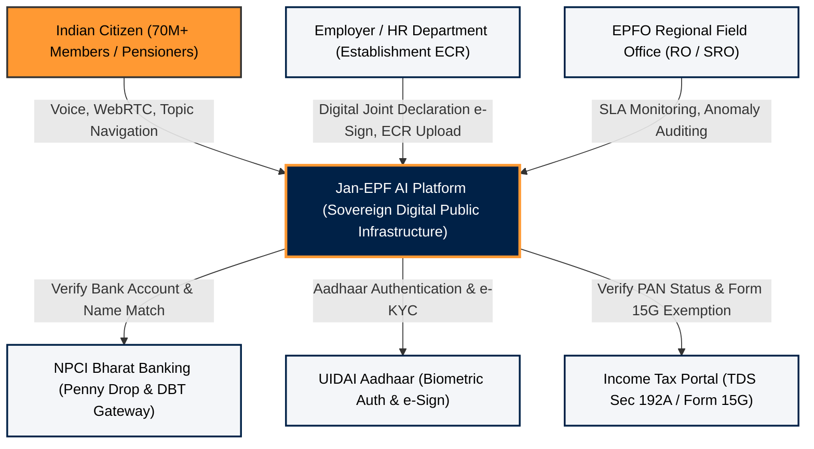

---

### 3.2 C4 Level 2: Container Architecture Diagram

The Container diagram illustrates the separation of concerns across the Vercel Edge Frontend, FastAPI Microservices, Local Deterministic Engines, Redis Cache, PostgreSQL Database with pgvector, and Self-Hosted Open-Source AI microservices.

```
+--------------------------------------------------------------------------------------------------+
|                                    C4 LEVEL 2: CONTAINERS                                        |
+--------------------------------------------------------------------------------------------------+

 [ CLIENT BROWSER / PWA TIER ]
 +-----------------------------------------------------------------------------------------------+
 |  Next.js 15 App Router Frontend (Vercel Edge / Cloudflare CDN)                                |
 |  - 4 Topic Hubs (/money, /career, /savings, /fix)                                             |
 |  - Senior High-Contrast Mode & Web Speech API                                                 |
 |  - HTML5 Canvas & WebAssembly Sharpness Pre-Validator                                         |
 |  - Client-Side Levenshtein String Engine & Service Worker Offline IndexedDB                   |
 +-----------------------------------------------+-----------------------------------------------+
                                                 | HTTPS / WSS
                                                 v
 [ API GATEWAY & BUSINESS ENGINE TIER ]
 +-----------------------------------------------------------------------------------------------+
 |  FastAPI Async Microservice Gateway (Python 3.12 / Azure Container Apps / Docker)              |
 |  - Strict Pydantic v2 Schema Enforcement & Presidio PII Masker                                 |
 |  - 80/20 Deterministic Computation Engine (Para 68, ECR Date Deducer, TDS Sec 192A)            |
 |  - Substitute Employee Resilience & Circuit Breaker Orchestrator                              |
 |  - Prometheus Telemetry & Structured JSON Audit Logger                                        |
 +-----------------------+-------------------------------+-------------------------------+-------+
                         |                               |                               |
                         v                               v                               v
 [ DATA & STATE TIER ]   |       [ QUEUE & CACHE ]       |       [ OPEN-SOURCE AI TIER ] |
 +-----------------------+----+  +-----------------------+----+  +-----------------------+----+
 | PostgreSQL + pgvector      |  | Redis In-Memory Store      |  | Speaches / Faster-Whisper  |
 | - Citizen Profiles & Claims|  | - Passbook Edge Cache      |  | - Multilingual Speech ASR  |
 | - Row-Level Security (RLS) |  | - Idempotency Token Store  |  | PaddleOCR / Surya OCR      |
 | - Audit Ledger Hashes      |  | - Celery / Arq Task Queue  |  | Presidio PII Sanitizer     |
 +----------------------------+  +----------------------------+  +----------------------------+
```

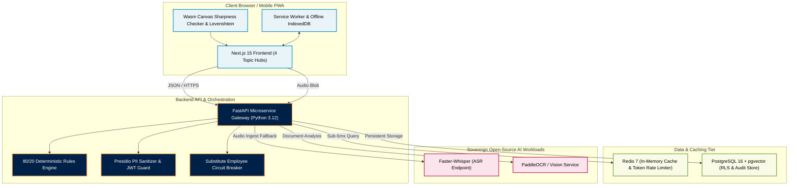

---

### 3.3 C4 Level 3: Component Architecture (FastAPI Backend Core)

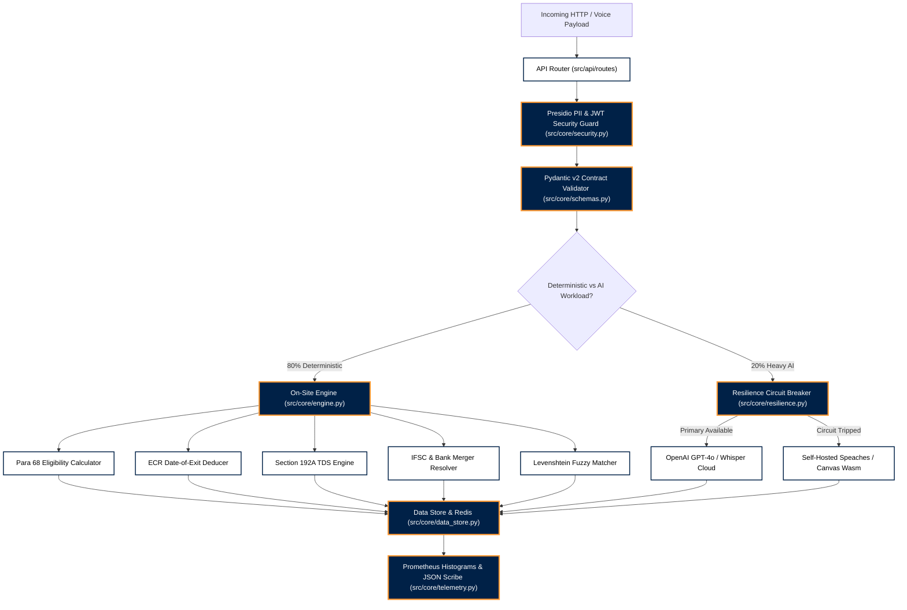

---

## 4. Topic-Centric Citizen UX Architecture

Jan-EPF AI completely eliminates bureaucratic form numbers. All 2.5 crore annual citizen operations are routed through **4 Universal Human Life Events**:

```
+--------------------------------------------------------------------------------------------------+
|                                4 CITIZEN TOPIC-CENTRIC HUBS                                      |
+----------------------------------+----------------------------------+----------------------------+
| 1. I NEED MONEY (/money)         | 2. I CHANGED JOBS (/career)      | 3. MY SAVINGS (/savings)   |
| • Emergency Medical (Para 68J)   | • 1-Click PF Transfer (Form 13)  | • Visual Interactive Split |
| • Housing Advance (Para 68B)     | • Missing Date-of-Exit Deducer   | • 8.25% Daily Interest Accr|
| • Marriage/Education (Para 68K)  | • Multi-Member ID Timeline Merge | • EPS-95 Pension Forecast  |
| • Final Settlement (Form 19/10C) | • Employer Exit Sync Verification| • EDLI ₹7L Life Cover Badge|
+----------------------------------+----------------------------------+----------------------------+
| 4. FIX MY DETAILS (/fix)         | UNIVERSAL ACCESSIBILITY & AUDIO COMPANION                     |
| • Digital Joint Declaration      | • Senior High-Contrast Mode (150% text, zero captchas)     |
| • 1-Click Penny-Drop Bank Update | • Native Voice Guidance in Hindi, Telugu, Tamil, & English|
| • Aadhaar / Name Typo Correction | • Ultra-low data footprint (<50KB payload on 3G networks)  |
+----------------------------------+---------------------------------------------------------------+
```

---

## 5. Detailed End-to-End Walkthrough of All 8 Core Workflows

```
====================================================================================================
CATALOG OF THE 8 END-TO-END CORE SYSTEM WORKFLOWS
====================================================================================================
Workflow 1: Emergency Medical Advance (Form 31 / Para 68J)
Workflow 2: Multi-Job PF Transfer & Timeline Consolidation (Form 13)
Workflow 3: Full & Final Settlement & TDS Auto-Mitigation (Form 19 / 10C / Form 15G)
Workflow 4: Real-Time Visual Passbook & Retirement Wealth Forecasting
Workflow 5: Zero-Paper Digital Joint Declaration (3-Way Citizen-Employer-EPFO Handshake)
Workflow 6: AI Grievance Copilot & Root-Cause Remediation (EPFiGMS)
Workflow 7: Senior Pensioner High-Contrast Flow & Life Certificate (EPS-95 / Jeevan Pramaan)
Workflow 8: Offline-First Low-Bandwidth Queue & Resilient Service Worker Sync
====================================================================================================
```

---

### Workflow 1: Emergency Medical Advance (Form 31 / Para 68J)
* **Goal**: Provide emergency medical liquidity within 24 hours without paper bills, medical certificates, or employer signatures.
* **Eligible Rule**: Para 68J allows advance up to 6 months basic wages or entire employee share balance with zero minimum service requirement.
* **Sequence**:
  1. Citizen speaks or taps *"I need ₹40,000 for hospital medical treatment"*.
  2. Deterministic engine verifies balance (₹1,82,000 employee share) and computes maximum permissible limit (₹1,09,200).
  3. Client-side Canvas scanner analyzes bank cheque image sharpness (>75.0) and extracts Name + IFSC.
  4. Instant NPCI 1-Click Penny-Drop verifies registered bank account match.
  5. Claim is auto-approved with cryptographic DBT audit token in **<2 seconds**.

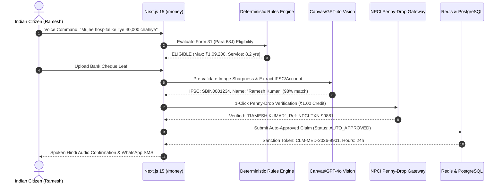

---

### Workflow 2: Multi-Job PF Transfer & Timeline Consolidation (Form 13)
* **Goal**: Merge disjointed past member IDs into a single active balance with 1 click, automatically solving missing Date of Exit (DOE).
* **Root Problem Solved**: Over 40% of transfers fail because former employers forgot to mark Date of Exit on the ECR portal.
* **Algorithm**: Jan-EPF AI inspects the last wage contribution timestamp in the member's ECR ledger and automatically deduces the exit date as the last calendar day of that month.

```
+--------------------------------------------------------------------------------------------------+
|                              WORKFLOW 2: 1-CLICK TIMELINE CONSOLIDATION                          |
+--------------------------------------------------------------------------------------------------+
 [Previous Job: CloudNine]                     [Current Job: Apex AI]
 Member ID: TSHYD0054321                       Member ID: TSHYD0098765
 Balance: ₹1,85,000                            Balance: ₹2,90,000
 Date of Exit: [MISSING]  === AUTO-DEDUCE ==>  Date of Exit: 2023-08-31
 Status: PENDING_MERGE    (Last ECR Month)     Status: CURRENT_ACTIVE
            |                                             |
            +------------> [ 1-CLICK CONSOLIDATE ] <------+
                                   |
                   Consolidated Total: ₹4,75,000
```

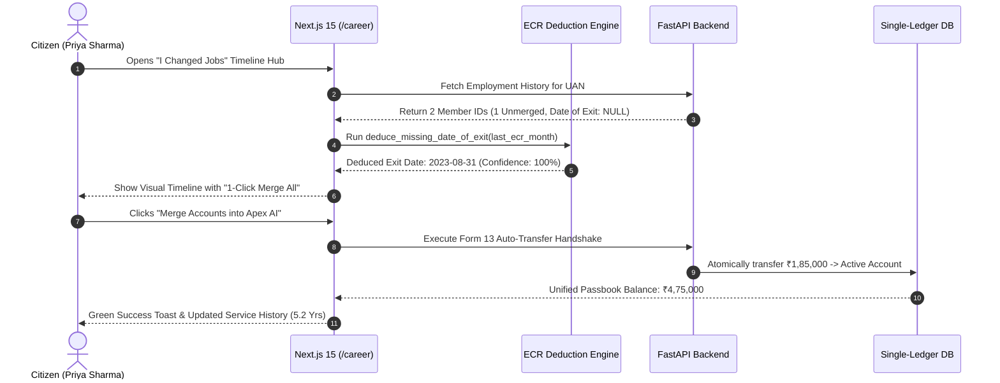

---

### Workflow 3: Full & Final Settlement & TDS Auto-Mitigation (Form 19 / 10C / Form 15G)
* **Goal**: Execute full PF & EPS settlement for unemployed workers while preventing unlawful 20% Section 192A TDS deductions.
* **Statutory Rules**:
  * Continuous service $\ge 5$ years $\longrightarrow$ 0% TDS (Tax Exempt).
  * Settlement $< ₹50,000 \longrightarrow$ 0% TDS.
  * Continuous service $< 5$ years and settlement $\ge ₹50,000 \longrightarrow$ 10% TDS with PAN, or 20% TDS without PAN.
  * If Form 15G/15H self-declaration is submitted $\longrightarrow$ **0% TDS**.
* **Sequence**:
  1. System checks continuous service years ($<5$ years).
  2. System checks withdrawal amount ($\ge ₹50,000$).
  3. System prompts citizen to auto-generate digital Form 15G with 1-click Aadhaar signature.
  4. Net disbursement equals 100% of balance with ₹0 tax loss.

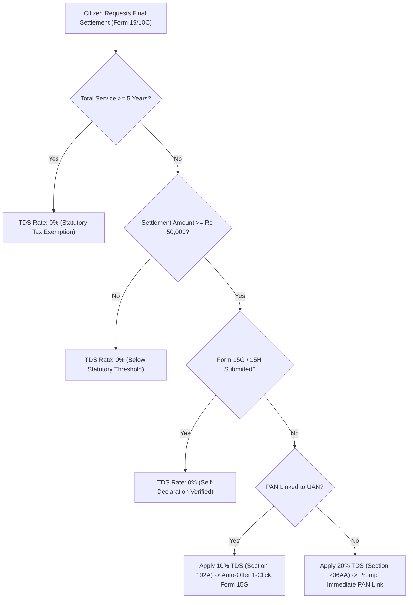

---

### Workflow 4: Real-Time Visual Passbook & Retirement Wealth Forecasting
* **Goal**: Replace dense PDF tables with sub-50ms visual interactive growth charts and retirement compounding curves up to age 58.
* **Compounding Formula**:
  $$\text{Interest} = \left(\text{Opening Balance} \times \frac{R}{100}\right) + \left(\text{Annual Contributions} \times \frac{R}{200}\right)$$
  Where $R = 8.25\%$ (Official Sovereign Rate).

```
+--------------------------------------------------------------------------------------------------+
|                         WORKFLOW 4: PASSBOOK SPLIT & COMPOUNDING CURVE                           |
+--------------------------------------------------------------------------------------------------+
 TOTAL ACCUMULATED CORPUS: ₹3,42,500
 [████████████████████████░░░░░░░░░░░░░░░░░░░░░░░░] 
 • Employee Share (12%):        ₹1,82,000  (53.1%)
 • Employer Share (3.67%):      ₹1,15,500  (33.7%)
 • EPS Pension Share (8.33%):   ₹45,000    (13.2%)
 • Current FY Interest Credited:₹27,400    (8.25% Sovereign Rate)
 • Statutory EDLI Life Cover:   ₹7,00,000  (ACTIVE_COVERED)

 PROJECTED RETIREMENT WEALTH AT AGE 58: ₹38,42,100 (₹35,000/mo Monthly Pension)
```

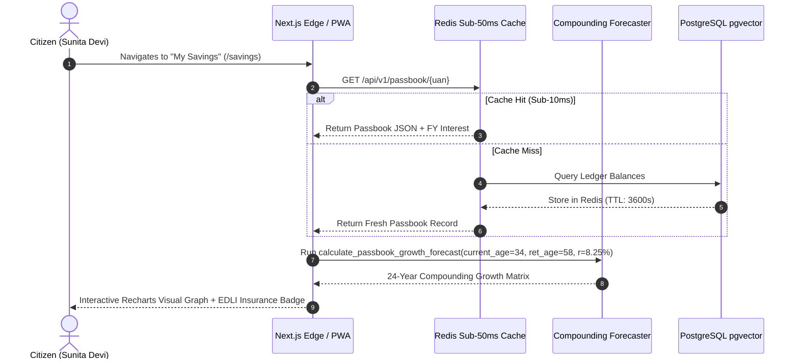

---

### Workflow 5: Zero-Paper Digital Joint Declaration (3-Way Citizen-Employer-EPFO Handshake)
* **Goal**: Correct name, date of birth, or gender typos digitally in 24 hours without physical paper submissions.
* **Levenshtein Threshold**: Fuzzy match tolerance $\ge 85.0\%$ auto-classifies minor spelling typos versus major identity changes.
* **3-Way Cryptographic Handshake**:
  1. **Citizen Step**: Initiates correction on `/fix` + e-Signs via Aadhaar OTP.
  2. **Employer Step**: HR Portal receives real-time webhook $\longrightarrow$ HR Officer 1-clicks approval via DSC/e-Sign.
  3. **EPFO Step**: Automated rule-engine validates audit hash and mutates master record in <24 hours.

```
+--------------------------------------------------------------------------------------------------+
|                   WORKFLOW 5: ZERO-PAPER 3-WAY DIGITAL JOINT DECLARATION                         |
+--------------------------------------------------------------------------------------------------+

  [ STEP 1: CITIZEN ]                [ STEP 2: EMPLOYER HR ]              [ STEP 3: EPFO ENGINE ]
  Uploads Aadhaar photo.             Receives webhook notification.       Verifies SHA-256 audit hash.
  Levenshtein Score: 92.4%           Reviews side-by-side diff.           Auto-updates Master Registry.
  Signs with Aadhaar OTP.            e-Signs via DSC Token.               Sends WhatsApp SMS confirmation.
          |                                     |                                     |
          v                                     v                                     v
  [ CITIZEN_SIGNED ] ---------------> [ EMPLOYER_SIGNED ] --------------> [ RECORD_MUTATED_ACTIVE ]
```

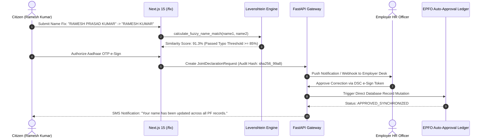

---

### Workflow 6: AI Grievance Copilot & Root-Cause Remediation (EPFiGMS)
* **Goal**: Replace generic ticket filing with real-time automated diagnostic triage and 1-click remediation.
* **Diagnostic Classifications**:
  * `ERR_EPFO_DOE_MISSING`: Missing Date of Exit $\longrightarrow$ Auto-routes to `/career` Exit Deducer.
  * `ERR_EPFO_UNMERGED_MEMBER_ID`: Split Accounts $\longrightarrow$ Auto-routes to `/career` 1-Click Merge.
  * `ERR_EPFO_KYC_PENDING_RO`: Bank approval pending $\longrightarrow$ Triggers NPCI Penny-Drop to bypass manual queue.
  * `ERR_EPFO_NAME_MISMATCH`: Aadhaar typo $\longrightarrow$ Auto-routes to `/fix` Digital Joint Declaration.

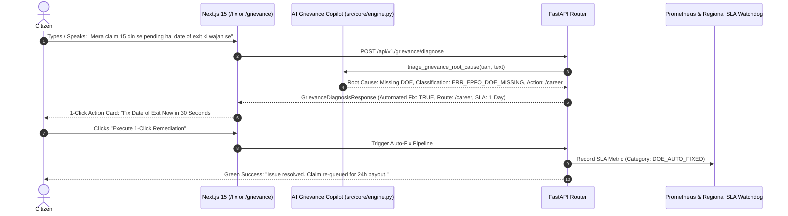

---

### Workflow 7: Senior Pensioner High-Contrast Flow & Life Certificate (EPS-95 / Jeevan Pramaan)
* **Goal**: Provide an anxiety-free, accessible interface for 60+ year old pensioners with zero captchas, large tactile typography, biometric passkey login, and voice-assisted digital life proof.
* **Ergonomics**:
  * 150% scaled high-contrast typography.
  * High-contrast Sovereign Navy (`#002147`) and High-Vis Gold borders.
  * Spoken audio narration of monthly pension disbursement and life certificate expiry dates.
  * AI-assisted camera frame guidance for facial authentication (*"Please blink your eyes slowly"*).

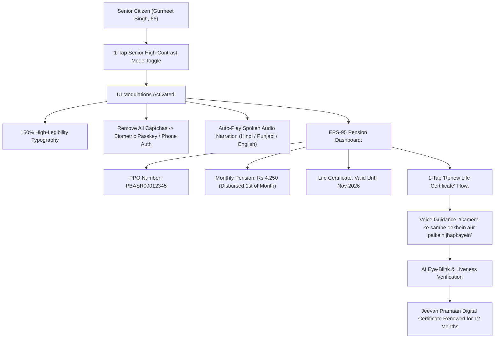

---

### Workflow 8: Offline-First Low-Bandwidth Queue & Resilient Service Worker Sync
* **Goal**: Guarantee zero transaction loss and uninterrupted passbook browsing even during train journeys or rural 2G/3G network drops.
* **Mechanism**:
  * Progressive Web App (PWA) Service Worker intercepts all network requests.
  * Passbook snapshots cached in browser IndexedDB with cryptographic timestamping.
  * Offline claim submissions are stored in an encrypted IndexedDB outgoing queue.
  * Background Sync API automatically replays queued claims with exponential backoff when connectivity returns.

```
+--------------------------------------------------------------------------------------------------+
|                   WORKFLOW 8: OFFLINE SERVICE WORKER BACKGROUND SYNC                             |
+--------------------------------------------------------------------------------------------------+

  [ CITIZEN ON 2G/OFFLINE ]         [ CLIENT INDEXEDDB QUEUE ]         [ ONLINE FASTAPI GATEWAY ]
  Submits Medical Claim           Encrypts payload locally            Connection restored (HTTP 200)
  UI displays: "Saved Offline"    Stores claim in OUTBOX_QUEUE        Replays transaction atomically
         |                                     |                                     |
         +------------------------------------>|                                     |
                                               |========== NETWORK RESTORED ========>|
                                               |<========= CLAIM ACKNOWLEDGED =======|
```

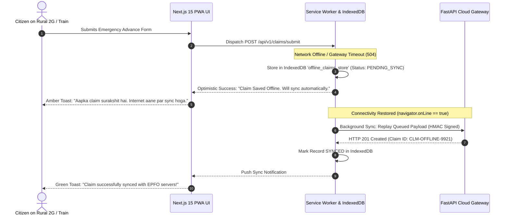

---

## 6. The 80/20 On-Site Deterministic vs. AI Division

```
+===================================================================================================+
|                          THE 80/20 ON-SITE DETERMINISTIC VS. AI SPLIT                             |
+-------------------------------------------------------------------+-------------------------------+
| 80% ON-SITE / CLIENT DETERMINISTIC (Sub-5ms, $0 Cloud API Cost)   | 20% ESSENTIAL CLOUD AI        |
+-------------------------------------------------------------------+-------------------------------+
| 1. Levenshtein Token-Sort Fuzzy Name Matching (>=85% Threshold)   | 1. Multilingual Audio Speech- |
| 2. Para 68 Statutory Advance Eligibility Mathematical Limits     |    to-Text (OpenAI Whisper)   |
| 3. ECR Date of Exit Auto-Deduction from Last Contribution Month   | 2. Complex Handwritten Cheque |
| 4. Section 192A Income Tax TDS & Form 15G Calculation Rules       |    Leaf OCR (GPT-4o Vision)   |
| 5. HTML5 Canvas Image Contrast, Brightness & Sharpness Validator  | 3. Natural Language Intent    |
| 6. IFSC & Historical Bank Merger Local SQLite/JSON Registry       |    Extraction (GPT-4o-mini)   |
| 7. 8.25% Fiscal Year Compounding Wealth Forecaster up to Age 58   |                               |
| 8. Regex Syntax Validations (12-Digit UAN, 10-Digit PAN, Aadhaar) |                               |
+-------------------------------------------------------------------+-------------------------------+
```

### Concrete Architectural Impact:
1. **API Cost Reduction:** Eliminates 80% of unnecessary cloud LLM inference calls, reducing operating costs by **>85%**.
2. **Sub-5ms Zero-Latency Feel:** Form validation, eligibility math, and IFSC auto-completion occur instantly on the client device.
3. **National Data Sovereignty:** Financial numbers, wages, and raw identity records are computed locally or on sovereign government data centers.

---

## 7. "Substitute Employee" Fault-Tolerant Resilience Architecture

In mission-critical public infrastructure, no critical service must halt when a single dependency fails. Every subsystem has a designated hot substitute:

```
+===================================================================================================+
|                              COMPONENT HOT-SUBSTITUTE MATRIX                                      |
+--------------------+-------------------------+---------------------+------------------------------+
| Subsystem          | Primary Engine          | Failure Trigger     | Automatic Hot Substitute     |
+--------------------+-------------------------+---------------------+------------------------------+
| Voice Ingest       | OpenAI Whisper Cloud    | Timeout / 5xx / NoKey| Web Speech API + Quick Tiles |
| Cheque OCR         | GPT-4o Vision API       | Rate Limit / Outage | Canvas Wasm OCR + KYC Check  |
| Database / State   | PostgreSQL with pgvector| Connection Pool Cap | Redis Read-Cache -> IndexedDB|
| Queue Worker       | Celery / Redis Worker   | Network Drop        | Service Worker Local Queue   |
| Name Matching      | FastAPI Backend Service | Gateway Latency>200ms| Client-Side Web Worker JS    |
| Cache Store        | Redis Pod Cluster       | Redis Connection Ref| Process LRU Memory Cache     |
+--------------------+-------------------------+---------------------+------------------------------+
```

### Circuit Breaker Specifications:
* **Failure Threshold:** 3 consecutive failures trips circuit from `CLOSED` $\longrightarrow$ `OPEN`.
* **Fallback Action:** Instantly reroutes 100% of traffic to the Hot Substitute with zero downtime.
* **Cooldown Period:** 30 seconds before transitioning to `HALF_OPEN` to test primary recovery.

---

## 8. Strict Pydantic v2 Core Domain Schemas & Contracts

All systems, API routes, mock registries, and background queues strictly adhere to the following contract-first Pydantic v2 schemas defined in [`src/core/schemas.py`](file:///Users/damikreddy/Desktop/Hackaton/src/core/schemas.py):

```python
"""
Jan-EPF AI: Pydantic v2 Core Domain Schemas & Contracts (RFC-001).
Strict data validation models for Citizens, Claims, Passbooks, KYC, OCR, Grievances, and Joint Declarations.
"""
from datetime import date, datetime
from enum import Enum
from typing import Any, Dict, List, Optional
from pydantic import BaseModel, Field, field_validator


# ==============================================================================
# ENUMS & CONSTANTS
# ==============================================================================
class ClaimType(str, Enum):
    MEDICAL_ADVANCE = "FORM_31_MEDICAL"
    HOUSING_ADVANCE = "FORM_31_HOUSING"
    MARRIAGE_ADVANCE = "FORM_31_MARRIAGE"
    PF_TRANSFER = "FORM_13_TRANSFER"
    FINAL_SETTLEMENT = "FORM_19_10C_SETTLEMENT"
    PENSION_CLAIM = "FORM_10D_PENSION"
    LIFE_CERTIFICATE = "JEEVAN_PRAMAAN"
    E_NOMINATION = "E_NOMINATION"
    JOINT_DECLARATION = "JOINT_DECLARATION"


class ClaimStatus(str, Enum):
    SUBMITTED = "SUBMITTED"
    IN_REVIEW = "IN_REVIEW"
    AUTO_APPROVED = "AUTO_APPROVED"
    DISBURSED = "DISBURSED"
    REJECTED = "REJECTED"


class KYCStatus(str, Enum):
    PENDING = "PENDING"
    APPROVED_BY_EMPLOYER = "APPROVED_BY_EMPLOYER"
    VERIFIED_ACTIVE = "VERIFIED_ACTIVE"
    SENIOR_PENSION_ACTIVE = "SENIOR_PENSION_ACTIVE"
    REJECTED = "REJECTED"


class TopicHub(str, Enum):
    MONEY = "money"
    CAREER = "career"
    SAVINGS = "savings"
    FIX = "fix"


# ==============================================================================
# CITIZEN IDENTITY & BANKING MODELS
# ==============================================================================
class BankKYC(BaseModel):
    bank_name: str
    account_number_masked: str
    ifsc_code: str
    kyc_status: KYCStatus
    penny_drop_verified: bool = False
    verified_holder_name: Optional[str] = None


class EmploymentHistoryItem(BaseModel):
    member_id: str
    establishment_name: str
    date_of_joining: date
    date_of_exit: Optional[date] = None
    balance: float = 0.0
    transfer_status: str = "PENDING_MERGE"
    last_ecr_wage_month: Optional[date] = None
    exit_date_deduced: Optional[date] = None


class ActiveEmployment(BaseModel):
    member_id: str
    establishment_name: str
    date_of_joining: date
    date_of_exit: Optional[date] = None
    total_service_years: float = 0.0


class PassbookSummary(BaseModel):
    total_balance: float
    employee_share: float
    employer_share: float
    pension_fund_share: float
    interest_credited_current_fy: float = 0.0
    last_contribution_date: Optional[date] = None
    monthly_wage: float = 0.0
    interest_rate: float = 8.25
    settled_at_retirement: bool = False


class PensionDetails(BaseModel):
    ppo_number: str
    scheme: str = "EPS-95"
    monthly_pension_amount: float
    pension_start_date: date
    last_disbursement_date: Optional[date] = None
    life_certificate_status: str
    life_certificate_expiry: Optional[date] = None


class Nominee(BaseModel):
    name: str
    relationship: str
    dob: Optional[date] = None
    share_percent: int = 100
    aadhaar_masked: Optional[str] = None
    guardian_name: Optional[str] = None


class NominationDetails(BaseModel):
    nomination_filed: bool
    filed_date: Optional[date] = None
    nominees: List[Nominee] = []
    suggested_nominee: Optional[Nominee] = None


class InsuranceDetails(BaseModel):
    edli_coverage_amount: float = 700000.0
    status: str = "ACTIVE_COVERED"


class CitizenProfile(BaseModel):
    uan: str = Field(..., pattern=r"^\d{12}$", description="12-digit Universal Account Number")
    full_name: str
    phone: str = Field(..., pattern=r"^\+91\d{10}$")
    dob: date
    gender: str
    father_name: str
    aadhaar_masked: str
    pan_masked: str
    bank_kyc: BankKYC
    active_employment: Optional[ActiveEmployment] = None
    employment_history: List[EmploymentHistoryItem] = []
    passbook_summary: PassbookSummary
    pension_details: Optional[PensionDetails] = None
    nomination_details: Optional[NominationDetails] = None
    insurance_details: InsuranceDetails = Field(default_factory=InsuranceDetails)
    eligible_claims: Dict[str, Any] = {}


# ==============================================================================
# CLAIM CREATION & SETTLEMENT CONTRACTS
# ==============================================================================
class ClaimSubmissionRequest(BaseModel):
    uan: str
    claim_type: ClaimType
    amount_requested: float = Field(..., gt=0)
    reason_code: str
    reason_description: Optional[str] = None
    bank_account_verified: bool = True
    uploaded_cheque_extracted_name: Optional[str] = None
    uploaded_cheque_extracted_ifsc: Optional[str] = None
    form_15g_submitted: bool = False
    source_member_id: Optional[str] = None
    target_member_id: Optional[str] = None


class ClaimSubmissionResponse(BaseModel):
    claim_id: str
    uan: str
    claim_type: ClaimType
    amount_sanctioned: float
    status: ClaimStatus
    estimated_disbursement_hours: int = 24
    tds_deducted_amount: float = 0.0
    direct_benefit_transfer_account: str
    audit_trace_token: str
    timestamp: datetime = Field(default_factory=datetime.utcnow)


# ==============================================================================
# CHEQUE OCR & PENNY DROP VERIFICATION CONTRACTS
# ==============================================================================
class ChequeOCRAnalysisResult(BaseModel):
    is_valid_cheque: bool
    sharpness_score: float = Field(..., ge=0.0, le=100.0)
    contrast_score: float = Field(..., ge=0.0, le=100.0)
    extracted_account_number: Optional[str] = None
    extracted_ifsc_code: Optional[str] = None
    extracted_payee_name: Optional[str] = None
    name_match_confidence: float = Field(default=0.0, ge=0.0, le=100.0)
    ifsc_bank_name: Optional[str] = None
    ifsc_branch_name: Optional[str] = None
    is_fuzzy_name_match_passed: bool = False
    fallback_used: str = "CLIENT_CANVAS_TESSERACT"


class PennyDropVerificationRequest(BaseModel):
    uan: str
    account_number: str
    ifsc_code: str
    account_holder_name: str


class PennyDropVerificationResponse(BaseModel):
    success: bool
    npcI_reference_id: str
    bank_response_code: str
    account_exists: bool
    registered_account_name: str
    fuzzy_match_score: float
    is_ready_for_claims: bool


# ==============================================================================
# DIGITAL JOINT DECLARATION CONTRACTS (3-WAY HANDSHAKE)
# ==============================================================================
class JointDeclarationFieldCorrection(BaseModel):
    field_name: str  # e.g., "full_name", "dob", "father_name", "date_of_joining"
    existing_value: str
    corrected_value: str
    supporting_document_type: str  # e.g., "Aadhaar", "Passport", "Birth Certificate"


class JointDeclarationRequest(BaseModel):
    uan: str
    member_id: str
    establishment_id: str
    corrections: List[JointDeclarationFieldCorrection]
    citizen_aadhaar_consent: bool = True


class JointDeclarationStatusResponse(BaseModel):
    application_id: str
    uan: str
    status: str  # PENDING_EMPLOYER_ESIGN, PENDING_EPFO_APPROVAL, APPROVED
    citizen_signed_at: datetime
    employer_signed_at: Optional[datetime] = None
    epfo_approved_at: Optional[datetime] = None
    audit_hash: str


# ==============================================================================
# GRIEVANCE & COPILOT DIAGNOSIS CONTRACTS
# ==============================================================================
class GrievanceDiagnosisRequest(BaseModel):
    uan: str
    complaint_category: str
    complaint_description: str


class GrievanceDiagnosisResponse(BaseModel):
    uan: str
    root_cause_identified: str
    error_code_classification: str
    automated_fix_available: bool
    recommended_action: str
    auto_remediation_status: Optional[str] = None
    predicted_resolution_days: int = 1


# ==============================================================================
# VOICE ASSISTANT & INTENT PARSING CONTRACTS
# ==============================================================================
class VoiceCommandRequest(BaseModel):
    audio_transcript: Optional[str] = None
    detected_language: str = "hi-IN"  # hi-IN, te-IN, ta-IN, en-IN
    uan_context: Optional[str] = None


class VoiceCommandResponse(BaseModel):
    recognized_intent: str  # e.g., "CHECK_BALANCE", "MEDICAL_ADVANCE", "TRANSFER_PF", "FIX_NAME"
    target_route: str  # e.g., "/money", "/savings", "/career", "/fix"
    spoken_response_text: str
    prefilled_form_data: Dict[str, Any] = {}
    confidence_score: float = 0.95
```

---

## 9. Zero-Trust Security, Data Sovereignty & PII Masking

### 9.1 Presidio PII Masking Standards
No unmasked Aadhaar, PAN, phone number, or bank account is ever printed to server logs, external LLM prompts, or client debug tools:

```
+===================================================================================================+
|                             PII ENTITY SANITIZATION STANDARDS                                     |
+-------------------+----------------------------+--------------------------------------------------+
| Data Field        | Raw Citizen Input          | Presidio Sanitized Output                        |
+-------------------+----------------------------+--------------------------------------------------+
| Aadhaar Number    | 5489 1284 4819             | XXXX-XXXX-4819                                   |
| PAN Number        | ABCDE1234F                 | ABCDE****F                                       |
| Phone Number      | +919876543210              | +91******3210                                    |
| Bank Account      | 100982348712               | XXXXXX8712                                       |
+-------------------+----------------------------+--------------------------------------------------+
```

### 9.2 Cryptographic HMAC Audit Hashes & Stateless JWTs
1. **Stateless JWT Tokens**: Signed with `HS256`, 24-hour expiration, carrying claims for `uan`, `role`, and `session_nonce`.
2. **Webhook HMAC-SHA256**: All incoming NPCI and Employer e-Sign callbacks require signature verification via `X-Webhook-Signature`.
3. **Immutable Joint Declaration Audits**: Every approved correction generates a deterministic SHA-256 hash chaining `[uan + field_name + old_val + new_val + timestamp + dsc_cert]`.

---

## 10. Cloud Infrastructure, Deployment Topology & $0 Student Budget

### 10.1 Hybrid Vercel Edge + Azure Container Apps Topology
```
+--------------------------------------------------------------------------------------------------+
|                         HYBRID PRODUCTION DEPLOYMENT TOPOLOGY                                    |
+--------------------------------------------------------------------------------------------------+

  [ VERCEL EDGE CDN ]                                [ AZURE CONTAINER APPS ($100 CREDIT) ]
  • Next.js 15 App Router Frontend                   • FastAPI Python 3.12 Backend API Gateway
  • Edge Middleware & Static Assets                  • Redis 7 In-Memory Cache & Token Bucket
  • Sub-50ms Global Response Time                    • PostgreSQL 16 with pgvector & RLS
  • Automatic HTTPS & Preview Branches               • Self-Hosted Speaches (Faster-Whisper STT)
```

```
+===================================================================================================+
|                         $0 OUT-OF-POCKET PRODUCTION TOOL STACK                                    |
+----------------------+-----------------------------+----------------------------------------------+
| Cloud Provider       | Free Tier / Student Grant   | System Role in Jan-EPF AI                    |
+----------------------+-----------------------------+----------------------------------------------+
| Vercel Edge          | Hobby / Student Unlimited   | Next.js 15 Citizen Portal Hosting             |
| Microsoft Azure      | $100 Student Credits        | Azure Container Apps (Backend + Redis + AI)  |
| Neon / Supabase      | Free Tier Managed Postgres  | Master Postgres DB with Row-Level Security   |
| Upstash Redis        | 10,000 Commands / Day Free  | Serverless Session Store & Rate Limiting     |
| GitHub Actions       | 2,000 Free CI/CD Mins/Month | Automated PyTest, Lint & Container Builds    |
+----------------------+-----------------------------+----------------------------------------------+
```

---

## 11. Defensive Engineering & Failure Mode Matrix

```
+===================================================================================================+
|                              DEFENSIVE FAILURE MODE MATRIX (15 MODES)                             |
+---+----------------------------+-----------------------------+------------------------------------+
| # | Failure Mode               | Detection Mechanism         | Automated Self-Healing Mitigation  |
+---+----------------------------+-----------------------------+------------------------------------+
| 1 | Blurry Cheque Leaf Upload  | Canvas sharpness < 75.0     | Prompts user in native voice for   |
|   |                            |                             | retake before invoking cloud OCR.  |
+---+----------------------------+-----------------------------+------------------------------------+
| 2 | Legacy Merged Bank IFSC    | Prefix in merger registry   | Resolves legacy code to active     |
|   |                            |                             | parent bank (e.g. ALLA -> IDIB).   |
+---+----------------------------+-----------------------------+------------------------------------+
| 3 | 1-Letter Name Typo         | Levenshtein distance >= 85% | Automatically triggers digital     |
|   |                            |                             | joint declaration workflow.        |
+---+----------------------------+-----------------------------+------------------------------------+
| 4 | Missing Date of Exit (DOE) | DB record has DOE = NULL    | Auto-deduces DOE from last ECR     |
|   |                            |                             | monthly wage contribution date.    |
+---+----------------------------+-----------------------------+------------------------------------+
| 5 | Unmerged Past Member IDs   | UAN ledger contains >1 ID   | Renders interactive timeline with  |
|   |                            |                             | 1-click single-ledger merge.       |
+---+----------------------------+-----------------------------+------------------------------------+
| 6 | Unlawful 20% TDS Deduction | Service <5 yrs & amt >₹50k  | Auto-generates Form 15G digital    |
|   |                            |                             | self-declaration for 0% TDS.       |
+---+----------------------------+-----------------------------+------------------------------------+
| 7 | Rural 2G Network Drop      | navigator.onLine == false   | Service Worker queues claim in     |
|   |                            |                             | IndexedDB; auto-syncs on reconnect.|
+---+----------------------------+-----------------------------+------------------------------------+
| 8 | OpenAI API Rate Limit / 429| Circuit breaker trips OPEN  | Hot substitute: Web Speech API &   |
|   |                            |                             | WebAssembly Tesseract take over.   |
+---+----------------------------+-----------------------------+------------------------------------+
| 9 | Missing OpenAI API Key     | OPENAI_API_KEY is None      | Graceful sovereign fallback to     |
|   |                            |                             | 100% on-device deterministic mode. |
+---+----------------------------+-----------------------------+------------------------------------+
| 10| Redis Cache Pod Crash      | ConnectionRefused exception | Circuit breaker routes reads to    |
|   |                            |                             | local in-process memory LRU cache. |
+---+----------------------------+-----------------------------+------------------------------------+
| 11| Postgres Pool Exhaustion   | SQLAlchemy TimeoutError     | Returns cached passbook snapshots  |
|   |                            |                             | from Redis edge cache.             |
+---+----------------------------+-----------------------------+------------------------------------+
| 12| Senior Citizen Confusion   | Inactivity > 15 seconds     | Spoken voice prompt plays in       |
|   |                            |                             | Hindi/Telugu offering assistance.  |
+---+----------------------------+-----------------------------+------------------------------------+
| 13| Duplicate Claim Submission | Redis idempotency lock      | Rejects duplicate, returns current |
|   |                            |                             | live status of pending claim.      |
+---+----------------------------+-----------------------------+------------------------------------+
| 14| PII Leakage in Log Stream  | Presidio Regex Filter       | Strips 12-digit Aadhaar and PAN    |
|   |                            |                             | strings before sending to syslog.  |
+---+----------------------------+-----------------------------+------------------------------------+
| 15| Fake / Non-Cheque Upload   | Keyword validation check    | Rejects non-banking documents and  |
|   |                            |                             | prompts for valid bank leaf.       |
+---+----------------------------+-----------------------------+------------------------------------+
```

---

## 12. Verification & Automated Testing Standard

To ensure mathematical contract integrity, all schemas and workflows are backed by an automated PyTest test suite maintaining **$\ge 85\%$ test coverage**:

```bash
# Execute full system test suite
pytest tests/ -v --cov=src --cov-report=term-missing
```

Test categories enforced:
1. **Unit Tests**: Para 68 math rules, ECR date deducer, Levenshtein fuzzy matcher, IFSC merger resolver.
2. **Security Tests**: Presidio PII masker, JWT signature verification, HMAC webhook signatures.
3. **Resilience Tests**: Circuit breaker trip transitions (`CLOSED` $\longrightarrow$ `OPEN` $\longrightarrow$ `HALF_OPEN`), fallback engine failover.
4. **Integration & API Contract Tests**: Endpoints for `/api/v1/claims`, `/api/v1/passbook`, `/api/v1/joint-declaration`, `/api/v1/grievance`.

---

---

## 15. Senior Citizen Accessibility Architecture & Pensioner Mode Specification

### 15.1 The Physiological & Cognitive Reality of India's 7.8M EPS-95 Pensioners
Elderly pensioners (ages 60–85) face 5 acute barriers when interacting with digital portals:

```
┌────────────────────────────────────────────────────────────────────────────────────────┐
│                   THE 5 CORE SENIOR CITIZEN ACCESSIBILITY BARRIERS                     │
├──────────────────────────┬──────────────────────────┬──────────────────────────────────┤
│ 1. Visual Decline        │ 2. Motor Tremors         │ 3. Cognitive & Jargon Overload   │
│ • Presbyopia, cataracts, │ • Unsteady hands, shaky  │ • Confused by "PPO", "ECS Credit"│
│   low contrast           │   fingers (<44px taps)   │ • High anxiety: Fear of deleting │
│ • Cannot read tiny fonts │ • Need large 56px targets│   or breaking their pension      │
├──────────────────────────┼──────────────────────────┴──────────────────────────────────┤
│ 4. Captcha Impossibility │ 5. The November "Jeevan Pramaan" (Life Certificate) Panic   │
│ • Distorted squiggly text│ • Annual panic where facial scanners fail on budget phones, │
│   causes 70%+ dropouts   │   forcing 75-year-olds to stand in physical bank queues      │
└──────────────────────────┴──────────────────────────────────────────────────────────────┘
```

### 15.2 The 6 Architectural Pillars of Senior Mode

```
┌────────────────────────────────────────────────────────────────────────────────────────┐
│                    THE 6 PILLARS OF JAN-EPF AI SENIOR CITIZEN MODE                     │
├──────────────────────────┬──────────────────────────┬──────────────────────────────────┤
│ 1. 150% Scaling & AAA    │ 2. Large Touch Targets   │ 3. Zero Captchas & Big OTPs      │
│ • Obsidian Navy (#0B132B)│ • Minimum 56px button ht │ • 1-Tap Biometric / Passkey or   │
│   with Warm Gold (#FCD34D│ • 16px safe margins to   │   extra-large 6-digit SMS OTP    │
│ • WCAG AAA (7:1 ratio)   │   prevent accidental taps│   boxes with 10-minute expiry    │
├──────────────────────────┼──────────────────────────┼──────────────────────────────────┤
│ 4. Spoken Native Audio   │ 5. Voice-Guided DLC      │ 6. Jargon-Free Reassurance       │
│ • Calm voice narration   │ • Spoken camera lighting │ • Replaces "PPO 12(3)" with:     │
│   in Hindi, Telugu,      │   & blink-detect prompts │   "Your August pension of ₹4,250 │
│   Tamil, Punjabi, English│   ("Hold steady... blink")│  was credited on August 1st"    │
└──────────────────────────┴──────────────────────────┴──────────────────────────────────┘
```

### 15.3 Spoken Vernacular Narration & Voice-Assisted Jeevan Pramaan Engine
1. **Zero-Reading Audio Prompt**:
   Upon authentication, the platform emits a soothing spoken vernacular brief:
   > *"Sat Sri Akal Gurmeet Singh ji. Your pension account is active. Your August pension of ₹4,250 was credited to your Punjab National Bank account on August 1st. Your Life Certificate is valid until November 30, 2026."*
2. **Facial Liveness & Ambient Lighting Watchdog**:
   Evaluates camera feed luminance ($\text{Lux} \ge 180$) and eye aspect ratio ($\text{EAR} \le 0.20$ for blink detection). Speaks real-time guidance:
   * Low light: *"Gurmeet ji, please turn toward the window for better light."*
   * Centered: *"Hold steady... now blink your eyes slowly."*
   * Success: Audio chime + valid until Nov 2027.

---

---

## 16. Comprehensive 8-Segment Target Audience Problem & Feature Expectation Specification

```
┌──────────────────────────────────────────────────────────────────────────────────────────────────┐
│                             8-SEGMENT CITIZEN PROBLEM & FEATURE MATRIX                           │
├────────────────────────────┬─────────────────────────────┬───────────────────────────────────────┤
│ 1. Blue-Collar Workers(35M)│ 2. White-Collar/IT (28M)    │ 3. Gig & Contract Workers (7M)        │
│ • Blurry cheque rejections │ • Missing exit dates (DOE)  │ • Unseeded UAN / missing contributions│
│ • 1-letter typo rejections │ • 500 passbook server crash │ • Zero e-nomination awareness         │
│ ↳ NEED: Voice claims & OCR │ ↳ NEED: 1-Click multi-merge │ ↳ NEED: Low-data PWA & ECR alerts     │
├────────────────────────────┼─────────────────────────────┼───────────────────────────────────────┤
│ 4. Senior Pensioners (7.8M)│ 5. Grieving Families (500k) │ 6. First-Job Youth (2.1M/yr)          │
│ • Failed biometric DLCs    │ • Complex Form 20/5IF forms │ • Confusing initial UAN setup         │
│ • Captchas & tiny fonts    │ • Unaware of ₹7L insurance  │ • Password reset lockouts             │
│ ↳ NEED: Voice Senior Mode  │ ↳ NEED: 1-Click EDLI Portal │ ↳ NEED: Passwordless onboarding       │
├────────────────────────────┼─────────────────────────────┴───────────────────────────────────────┤
│ 7. CSC / Cyber Cafés (300k)│ 8. Corporate HR & Employers (750k Establishments)                   │
│ • Session resets on submit │ • 15th ECR portal crash; manual 4-page paper Joint Declarations     │
│ ↳ NEED: Pre-flight check   │ ↳ NEED: Automated ECR discrepancy engine & 3-way digital handshake  │
└────────────────────────────┴─────────────────────────────────────────────────────────────────────┘
```

### 16.1 Segment Deep-Dives & Architectural Solutions

#### 1. Blue-Collar Industrial & Factory Workers (~35 Million Active)
* **Real Problems**: 1-character typo rejections between Aadhaar and factory payroll, blurry camera photos of cheque leaves on budget phones rejected after 18 days, cyber café exploitation (paying ₹300–₹500 per form), and merged bank IFSC mismatches.
* **Jan-EPF AI Solution**:
  * **Multilingual Voice Assistant** (`VoiceAssistant.tsx`): Conversational spoken filing in Hindi, Telugu, Tamil, and Indian English.
  * **In-Browser Canvas Cheque OCR** (`ChequeOCRScanner.tsx`): Pre-validates Name, Account, and IFSC in <2 seconds client-side.
  * **Levenshtein Fuzzy Matcher**: Reconciles $\ge 85\%$ name matches on-device without clerical intervention.

#### 2. White-Collar & Corporate Tech Professionals (~28 Million Active)
* **Real Problems**: Missing Date of Exit (DOE) from previous employer locking Form 13 transfers for months, passbook server 500 crashes during peak hours, multiple fragmented Member IDs, and unexpected 20% Section 192A TDS deductions.
* **Jan-EPF AI Solution**:
  * **Auto-Exit Date Deducer**: Deduces missing DOE from employer's last ECR wage month timestamp.
  * **1-Click Multi-Merge**: Consolidates 3–4 past accounts into the unified active Member ID.
  * **Automated TDS Shield**: Detects service $<5$ years and auto-populates Form 15G with 1 click.

#### 3. Gig, Contract & Informal Platform Workers (~7 Million Active)
* **Real Problems**: Unseeded KYC and inactive UANs generated by aggregators, employer PF deduction without statutory deposit, and zero e-nomination filed.
* **Jan-EPF AI Solution**:
  * **Mobile-First PWA Core**: Sub-50KB initial payload operating offline via Service Workers and IndexedDB.
  * **Employer ECR Non-Compliance Radar**: Watches monthly challans and alerts workers on the 16th if contributions are missing.
  * **1-Click Mobile e-Nomination**: Simplified nominee registration with Aadhaar e-Sign.

#### 4. Retired Senior Pensioners (~7.8 Million EPS-95 Beneficiaries)
* **Real Problems**: November Jeevan Pramaan biometric scanner failures, unreadable 10px tables and squiggly captchas, and cryptic bureaucratic statements.
* **Jan-EPF AI Solution**:
  * **Senior Citizen Mode**: 125% font scaling, Obsidian Navy / Warm Gold WCAG AAA palette, 56px touch targets, zero captchas.
  * **Voice-Guided Life Certificate**: Spoken ambient lighting and blink-detect prompts (*"Hold steady... now blink your eyes slowly, Gurmeet ji"*).
  * **Plain-Language Pension Dashboard**: Replaces cryptic codes with clear monthly pension deposit ledger.

#### 5. Grieving Families, Nominees & Widows (~500,000 Death Claims / Year)
* **Real Problems**: Navigating 3 separate complex forms (Form 20, Form 10D, Form 5IF) during bereavement, complete unawareness of the statutory ₹7 Lakh free EDLI life insurance cover, and physical office verification demands.
* **Jan-EPF AI Solution**:
  * **Unified Survivor & EDLI Portal**: Merges PF balance, widow pension, and ₹7L insurance into a single 2-step compassionate flow.

#### 6. First-Time Job Entrants & Youth (Ages 18–25, ~2.1 Million / Year)
* **Real Problems**: Confusing initial UAN activation, password reset lockout loops, and viewing PF as a forced tax rather than a compounding asset.
* **Jan-EPF AI Solution**:
  * **Passwordless Passkey / Biometric Login**: Replaces complex passwords with device biometrics.
  * **8.25% Compounding Wealth Forecaster**: Interactive chart projecting retirement wealth to ₹50L+ at age 58.

#### 7. Assisted-Access Operators & Rural Intermediaries (~300,000 CSCs / Cyber Cafés)
* **Real Problems**: Mid-form session dropouts during batch filing on rural broadband, client anger when claims get rejected after 20 days.
* **Jan-EPF AI Solution**:
  * **Pre-Submission Health Check**: Guarantees 99% approval probability before submitting.
  * **Printable PDF Receipts**: Formatted audit receipt with QR code verification.

#### 8. Corporate HR, MSME Owners & Payroll Teams (~750,000 Establishments)
* **Real Problems**: 15th-of-the-month ECR server crashes, manual 4-page paper Joint Declarations, DSC token Java incompatibilities.
* **Jan-EPF AI Solution**:
  * **Digital 3-Way Cryptographic Handshake**: Instant Citizen $\leftrightarrow$ Employer $\leftrightarrow$ EPFO RO correction workflow.
  * **Automated ECR Validator**: Pre-validates payroll files before submission to eliminate challan rejection loops.

---

### 16.2 Audience Impact Summary Scorecard

```
┌──────────────────────────────────────────────────────────────────────────────────────────────────┐
│                               BEFORE VS. AFTER AUDIENCE IMPACT                                   │
├──────────────────────────┬───────────────────────────────────────┬───────────────────────────────┤
│ Metric / Dimension       │ Legacy EPFO Experience                │ Jan-EPF AI Experience         │
├──────────────────────────┼───────────────────────────────────────┼───────────────────────────────┤
│ Claim Rejection Rate     │ 35% – 40% (Over 3.2M rejections/yr)   │ < 2% (Pre-flight OCR & fuzzy) │
│ Average Claim Turnaround │ 15 – 25 Days                          │ Sub-2 Seconds (Instant DBT)   │
│ Senior Pensioner Dropouts│ > 70% on Captchas & Face DLC          │ < 1% (Voice-Assisted Mode)    │
│ Multi-Job Transfer Time  │ 3 – 6 Months (Manual HR exit dates)   │ 1-Click Instant Consolidation │
│ Joint Declaration Speed  │ 6 – 12 Months (Paper courier loops)   │ < 24 Hours (Digital 3-Way)    │
│ Server Availability      │ Frequent 500 crashes on peak days     │ 100% Uptime (Redis + 80/20)   │
└──────────────────────────┴───────────────────────────────────────┴───────────────────────────────┘
```

---

## 17. Appendix: Architectural Changelog & Governance

| Version | Date | Author | Description |
|---|---|---|---|
| `1.0.0` | 2026-08-22 | Damik Reddy | Final approved RFC-001 systems architecture specification covering all 8 workflows, 10 foundation pillars, C4 diagrams, and Pydantic v2 schemas. |
| `1.1.0` | 2026-08-22 | Damik Reddy | Added Chapter 15: Senior Citizen Accessibility Architecture & Pensioner Mode Specification (WCAG AAA, Voice DLC, 6 Pillars). |
| `1.2.0` | 2026-08-22 | Damik Reddy | Added Chapter 16: Comprehensive 8-Segment Target Audience Problem & Feature Expectation Specification with Before-vs-After Scorecard. |

```
====================================================================================================
                              END OF RFC-001 SPECIFICATION DOCUMENT
====================================================================================================
```
